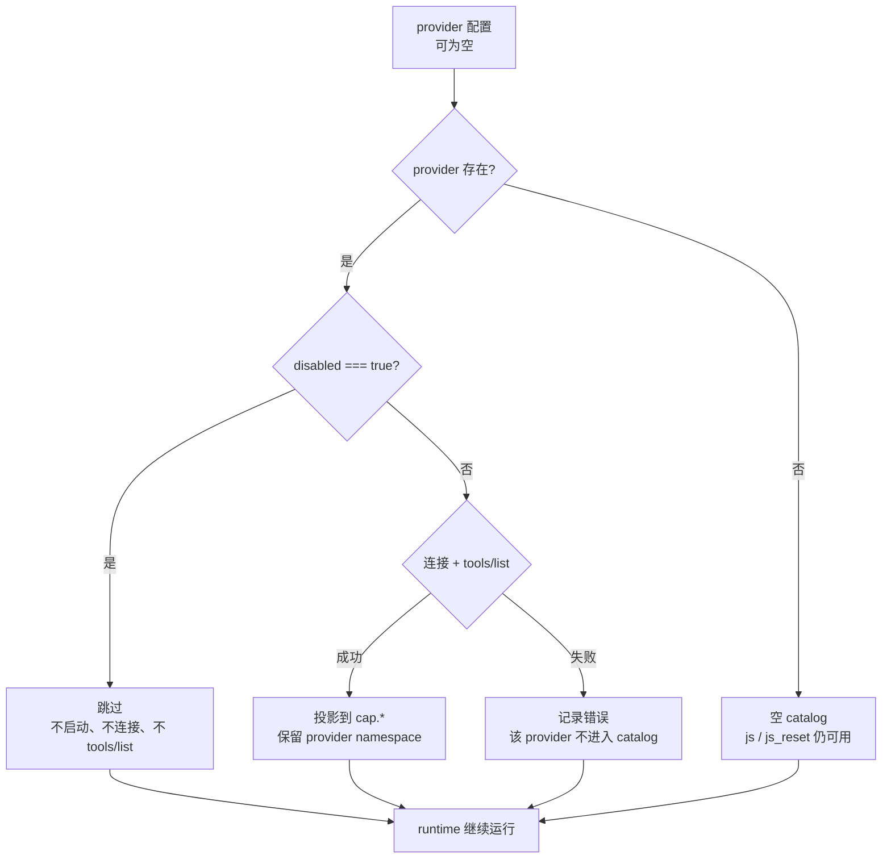

# 架构：DSH 工具面、内核与 MCP provider

> 这张图解释四个边界：DSH/Cordis 插件、宿主 runtime、常驻 JavaScript 内核、外部 MCP provider。
> `js` / `js_reset` 是 DSH 模型可见的工具；IDEA、Chrome、Cua、Blender 等是被投影进 `cap.*` 的外部 MCP 能力。

## 1. 组件图

```mermaid
flowchart LR
  subgraph dsh["DSH / Cordis host"]
    profile["Profile patch\nprovider config"]
    bootstrap["node-repl-runtime-bootstrap\n@lyd123qw2008/node-repl-dsh-bootstrap"]
    face["node-repl-runtime-face\n@lyd123qw2008/node-repl-dsh-adapter"]
    tools["Model-visible tools\njs / js_reset"]
  end

  subgraph host["node-repl-runtime host"]
    runtime["CapabilityRuntime\nprovider lifecycle + catalog"]
    catalog["MCP catalog\nconnect · tools/list · project"]
    bridge["Host bridge\nloopback TCP + per-run token"]
  end

  subgraph kernel["Persistent kernel child"]
    qwen["@qwen-code/node-repl-mcp\nstdio MCP server"]
    nrcap["nr-cap\ncap.* namespace"]
    cell["JavaScript cell\ntop-level await + persistent bindings"]
  end

  subgraph external["External MCP providers"]
    idea["IDEA MCP"]
    chrome["Chrome / Playwright MCP"]
    desktop["Cua / Blender / other MCP"]
  end

  profile -->|"config.providers"| bootstrap
  bootstrap -->|"ctx.provide(nodeReplRuntime)"| runtime
  face -->|"ctx.tools.register"| tools
  tools -->|"runtime.js / runtime.jsReset"| runtime

  runtime -->|"starts"| qwen
  runtime -->|"creates"| bridge
  runtime -->|"connects and projects"| catalog
  catalog -->|"streamable HTTP / stdio MCP"| idea
  catalog -->|"streamable HTTP / stdio MCP"| chrome
  catalog -->|"streamable HTTP / stdio MCP"| desktop

  qwen -->|"loads catalog snapshot"| nrcap
  nrcap -->|"installs"| cell
  cell -->|"cap.provider.operation"| bridge
  bridge -->|"provider.operation"| catalog
```



### 组件职责

| 组件 | 职责 | 不负责什么 |
| --- | --- | --- |
| `node-repl-runtime-bootstrap` | 读取 provider 配置，创建并提供 `nodeReplRuntime` | 不注册模型可见工具 |
| `node-repl-runtime-face` | 注册 `js` 和 `js_reset` 两个 DSH 工具 | 不连接 MCP provider，不创建 runtime |
| `CapabilityRuntime` | 管理 provider 连接、catalog、bridge 和 kernel 生命周期 | 不为某个 provider 编写专属分支 |
| `@qwen-code/node-repl-mcp` | 提供常驻 JavaScript kernel 的底层 MCP 服务 | 不直接连接 IDEA、Blender 等外部 provider |
| `nr-cap` | 在 kernel 中安装 `cap.*` 命名空间和发现辅助函数 | 不自行决定 provider 权限 |
| 外部 MCP provider | 广告工具并执行 `tools/call` | 不参与 DSH 工具注册 |

## 2. Provider 生命周期



当前约定与 DSH MCP 注册行为一致：

- provider 连接失败不会阻止 runtime 启动；
- 失败 provider 不出现在 `runtime.catalog()`、`cap.list()` 或 `cap.<id>`；
- 其他 provider 继续工作；
- 所有 provider 都失败、全部 provider 都 disabled、或根本没有 provider，都是合法的空 runtime；
- `disabled` 是连接前的 provider 开关；`include` 是连接后的工具暴露收窄；`inject` 是宿主拥有的调用参数；
- 当前 catalog 在 runtime 启动时安装进 kernel。自动重连和运行中动态替换 catalog 属于后续生命周期能力，不是 provider 配置本身。

## 3. 一次调用的路径

```text
模型
  │ 调用 js({ code })
  ▼
node-repl-runtime-face
  │ runtime.js(code)
  ▼
CapabilityRuntime / kernel MCP client
  │ 执行 JavaScript cell
  ▼
cell: cap.idea.search_text(args)
  │ nr-cap 通过 bridge 发出 provider.operation
  ▼
host bridge
  │ 校验 token、provider、operation，并转发 tools/call
  ▼
IDEA MCP server
  │ 返回 structuredContent 或 content blocks
  ▼
cell → nodeRepl.write(...) → js 工具结果
```

关键边界：

- 模型只声明两个工具，不随着 MCP provider 数量增长；
- provider 的工具 schema 来自本次 `tools/list`，只做 `inject` 删除和可选 `include` 收窄；
- provider 结果由 runtime 原样转发，不改写成另一套 provider-specific 结构；
- kernel 不能直接访问外部 MCP，调用必须经过宿主 bridge。

## 4. 对应实现

- [DSH adapter：注册 `js` / `js_reset`](../packages/adapter-dsh/src/index.ts)
- [DSH bootstrap：提供 `nodeReplRuntime`](../packages/dsh-bootstrap/src/index.ts)
- [Runtime facade：创建 kernel、bridge 和 provider catalog](../packages/runtime/src/index.ts)
- [MCP catalog：连接、发现、投影和调用 provider](../packages/runtime/src/catalog.ts)
- [Kernel session：启动 `@qwen-code/node-repl-mcp` 并安装 `nr-cap`](../packages/runtime/src/kernel.ts)
- [Provider 接入规范](./03-integration-spec.zh-CN.md)
