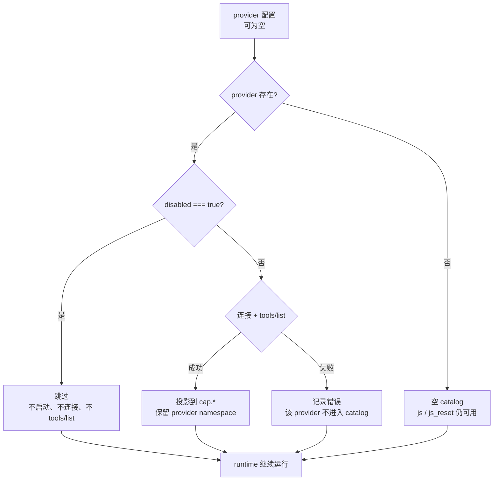

# 架构：DSH 工具面、内核与 MCP provider

> 这张图解释四个边界：DSH/Cordis 插件、宿主 runtime、常驻 JavaScript 内核、外部 MCP provider。
> `js` / `js_reset` 是 DSH 模型可见的工具；IDEA、Chrome、Cua、Blender 等是被投影进 `cap.*` 的外部 MCP 能力。

## 1. 组件图


```mermaid
flowchart LR
  subgraph dsh["DSH / Cordis host"]
    profile["Profile patch\nprovider config"]
    bootstrap["node-repl-runtime-bootstrap\n@lyd123qw2008/node-repl-dsh-bootstrap"]
    face["node-repl-runtime-face\n@lyd123qw2008/node-repl-dsh-adapter"]
    tools["Model-visible tools\njs / js_reset"]
  end

  subgraph host["node-repl-runtime host"]
    runtime["CapabilityRuntime\nprovider lifecycle + catalog"]
    catalog["MCP catalog\nconnect · tools/list · project"]
    bridge["Host bridge\nloopback TCP + per-run token"]
  end

  subgraph kernel["Persistent kernel child"]
    qwen["@qwen-code/node-repl-mcp\nstdio MCP server"]
    nrcap["nr-cap\ncap.* namespace"]
    cell["JavaScript cell\ntop-level await + persistent bindings"]
  end

  subgraph external["External MCP providers"]
    idea["IDEA MCP"]
    chrome["Chrome / Playwright MCP"]
    desktop["Cua / Blender / other MCP"]
  end

  profile -->|"config.providers"| bootstrap
  bootstrap -->|"ctx.provide(nodeReplRuntime)"| runtime
  face -->|"ctx.tools.register"| tools
  tools -->|"runtime.js / runtime.jsReset"| runtime

  runtime -->|"starts"| qwen
  runtime -->|"creates"| bridge
  runtime -->|"connects and projects"| catalog
  catalog -->|"streamable HTTP / stdio MCP"| idea
  catalog -->|"streamable HTTP / stdio MCP"| chrome
  catalog -->|"streamable HTTP / stdio MCP"| desktop

  qwen -->|"loads catalog snapshot"| nrcap
  nrcap -->|"installs"| cell
  cell -->|"cap.provider.operation"| bridge
  bridge -->|"provider.operation"| catalog
```

### 组件职责

| 组件 | 职责 | 不负责什么 |
| --- | --- | --- |
| `node-repl-runtime-bootstrap` | 读取 provider 配置，创建并提供 `nodeReplRuntime` | 不注册模型可见工具 |
| `node-repl-runtime-face` | 注册 `js` 和 `js_reset` 两个 DSH 工具 | 不连接 MCP provider，不创建 runtime |
| `CapabilityRuntime` | 管理 provider 连接、catalog、bridge 和 kernel 生命周期 | 不为某个 provider 编写专属分支 |
| `@qwen-code/node-repl-mcp` | 提供常驻 JavaScript kernel 的底层 MCP 服务 | 不直接连接 IDEA、Blender 等外部 provider |
| `nr-cap` | 在 kernel 中安装 `cap.*` 命名空间和发现辅助函数 | 不自行决定 provider 权限 |
| 外部 MCP provider | 广告工具并执行 `tools/call` | 不参与 DSH 工具注册 |

## 2. Provider 生命周期


```mermaid
flowchart TD
  config["provider 配置\n可为空"] --> present{"provider 存在?"}
  present -->|"否"| empty["空 catalog\njs / js_reset 仍可用"]
  present -->|"是"| disabled{"disabled === true?"}
  disabled -->|"是"| skipped["跳过\n不启动、不连接、不 tools/list"]
  disabled -->|"否"| connect{"连接 + tools/list"}
  connect -->|"成功"| projected["投影到 cap.*\n保留 provider namespace"]
  connect -->|"失败"| failed["记录错误\n该 provider 不进入 catalog"]
  skipped --> ready["runtime 继续运行"]
  projected --> ready
  failed --> ready
  empty --> ready
```

当前约定与 DSH MCP 注册行为一致：

- provider 连接失败不会阻止 runtime 启动；
- 失败 provider 不出现在 `runtime.catalog()`、`cap.list()` 或 `cap.<id>` —— 它们不是能力，没有可调用的东西；
- 但失败会出现在 `runtime.failures()` 与 `capHelp()` 的失败区，带原因（`<id> — NOT ATTACHED: <error>`）。只列存在的发现面回答不了"cua 去哪了"，实测中一个连接失败的 provider 与一个从未配置过的 provider 完全无法区分；
- 其他 provider 继续工作；
- 所有 provider 都失败、全部 provider 都 disabled、或根本没有 provider，都是合法的空 runtime；
- `disabled` 是连接前的 provider 开关；`include` 是连接后的工具暴露收窄；`inject` 是宿主拥有的调用参数；
- 会话在运行期失效（服务端重启后忘记 session id、stdio 子进程死亡）由 provider 自己恢复：
  一次调用检测到会话丢失就 **重连一次 + 重试一次**，catalog 随回包刷新进内核，
  不必重启 DSH profile；
- **启动时不可达**的 provider 也不再是一去不返：它的 spec 被保留，`cap.reconnect(id)` 可以在运行期
  首次接入（`cap.status()` 会以 `attached: false` + 原因列出它）；只有 `disabled: true` 明确拒绝。
  详见 [`docs/08-mcp-session-recovery.zh-CN.md`](08-mcp-session-recovery.zh-CN.md)。
- **provider 并发连接**：启动时几个 provider 的握手是并行的，所以启动成本是"最慢那个"而不是"它们的和"；
  失败列表按配置顺序输出，不按谁先答完（否则同一份配置每次跑出来的 `capHelp()` 顺序都会变）；
- **调用预算跟着活干走**：默认 300 s 只约束**静默**的调用——运行时会请求进度通知
  （`onprogress`，SDK 只有拿到它才会附 `_meta.progressToken`）并让每条通知续期
  （`resetTimeoutOnProgress`，SDK 默认是关的）。所以一次五分钟以上的 IDEA Rebuild 不会被
  `Request timed out` 打断。真正的界仍是 **cell 预算**（cell 超时会 abort 该调用并让 SDK 发出取消），
  另有 1 小时硬顶兜底；per-provider 可用 `timeoutMs` 覆盖。
  **实测（2026-09-29，真 IDEA）**：`execute_terminal_command` 一个 3.2 s 的操作期间约 **1 s 一条**进度
  通知。同一个 3.2 s 调用配 1.5 s 超时：带 `resetTimeoutOnProgress` **成功（3173 ms）**，
  不带则 **1600 ms 就 `Request timed out`**（期间已收到 2 条通知）。由此得到一条纪律——
  **provider `timeoutMs` 必须显著大于通知间隔**，否则续期只是把死亡推迟一个间隔
  （`timeout: 1000` 配 ≈1.02 s 间隔时，存活从 1089 ms 推到 2099 ms 后仍然死）；
  默认 300 s 相对 1 s 间隔有 300× 余量，因此安全。
- **预算咬到在飞的调用时点名**：cell 因预算/崩溃/取消结束、且当时还有 provider 调用在飞时，
  结果里会附一行 `[cell budget 30000 ms expired with idea.build_project (28.4 s) still in flight — …]`。
  写在这里（而不是只写进文档）是因为读到它的人正是要决定"重试还是别重试"的那个：
  它同时区分了"该加预算"与"工具卡死"，并提醒带副作用的调用先查状态再重跑。
  **默认值刻意保持 30 s**：内核的活动槽是全进程共享的，把默认抬高会让每一个卡住的 cell
  都拖住所有会话；所以走"按需声明 + 失败自解释"，而不是"放宽全局"。

## 3. 一次调用的路径

```text
模型
  │ 调用 js({ code })
  ▼
node-repl-runtime-face
  │ runtime.js(code)
  ▼
CapabilityRuntime / kernel MCP client
  │ 执行 JavaScript cell
  ▼
cell: cap.idea.search_text(args)
  │ nr-cap 通过 bridge 发出 provider.operation
  ▼
host bridge
  │ 校验 token、provider、operation，并转发 tools/call
  ▼
IDEA MCP server
  │ 返回 structuredContent 或 content blocks
  ▼
cell → nodeRepl.write(...) → js 工具结果
```

关键边界：

- 模型只声明两个工具，不随着 MCP provider 数量增长；
- provider 的工具 schema 来自本次 `tools/list`，只做 `inject` 删除和可选 `include` 收窄；
- provider 结果由 runtime 原样转发，不改写成另一套 provider-specific 结构；
- kernel 不能直接访问外部 MCP，调用必须经过宿主 bridge。

## 4. 对应实现

- [DSH adapter：注册 `js` / `js_reset`](../packages/adapter-dsh/src/index.ts)
- [DSH bootstrap：提供 `nodeReplRuntime`](../packages/dsh-bootstrap/src/index.ts)
- [Runtime facade：创建 kernel、bridge 和 provider catalog](../packages/runtime/src/index.ts)
- [MCP catalog：连接、发现、投影和调用 provider](../packages/runtime/src/catalog.ts)
- [Kernel session：启动 `@qwen-code/node-repl-mcp` 并安装 `nr-cap`](../packages/runtime/src/kernel.ts)
- [Provider 接入规范](./03-integration-spec.zh-CN.md)
