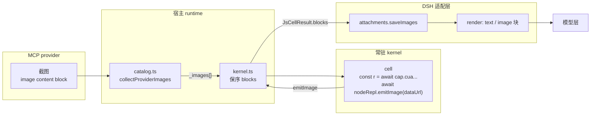

# 图片通路：provider 截图与 `emitImage` 如何到达模型

> 本文解决一个实测出来的缺口：`cap.cua.get_window_state()` 回传了 `screenshot_mime_type` /
> `screenshot_width` / `screenshot_height`，却没有任何像素——cell 里看不到截图，模型也就无法
> "先看一眼再动手"。缺口有两处，一处在入站（provider → kernel），一处在出站（kernel → 模型）。
> 本文给出两处的设计、预算语义、降级语义，以及明确不做的事。

## 1. 现象与两个断点

实测（2026-09-22，用 `cap.cua.*` 驱动 Windows 画图）：

```text
cell: await cap.cua.get_window_state({ pid, window_id })
  → 返回 { _note, elements, tree_markdown, screenshot_mime_type, screenshot_width, ... }
  → 没有像素
```

拆开看是两个独立的断点，缺一个都不通：

| # | 断点 | 位置 | 后果 |
| --- | --- | --- | --- |
| 1 | 入站 | [`catalog.ts`](../packages/runtime/src/catalog.ts) `structuredContent ?? content` | 驱动的截图在 MCP 的 image content block 里，被 `??` 的左侧命中后整块丢弃 |
| 2 | 出站 | [`kernel.ts`](../packages/runtime/src/kernel.ts) 只 `filter(block => block.type === 'text')`；[`types.ts`](../packages/runtime/src/types.ts) 的 `JsCellResult.output` 是 `string` | 内核即使产出了图片块，运行时也没有放它的位置；适配层只能渲染纯文本 |

第 2 条不是"内核不会吐图"。上游 `@qwen-code/node-repl-mcp` 的 cell API 明确提供
`nodeRepl.emitImage(png|jpeg|webp)`，其 `output-adapter` 会把 cell 产出转成
`{ content: [text | image, ...] }`，**保序交错**。也就是说：官方那一段是通的，是我们在自己的
边界上把图片拍平了。

## 2. 上游参照（Qwen 的取舍）

`@qwen-code/node-repl-mcp` 的 README 明确写了两件事（Provenance 段）：

- "The qwen-coupled result converter was replaced by `output-adapter.ts`, which emits MCP content blocks."
- "this runtime has no trusted-package or **capability mechanism**."

这两句划出了本文的边界：

- **有先例可抄的是出站**：图片作为 MCP content block 直接进 `js` 工具结果；显式 `emitImage` 才回传（普通表达式结果**不返回**）；保序交错；超限永远可见。
- **没有先例可循的是入站**：上游没有 provider 目录，`cap.*` 这一层是本项目自己的发明，"provider 返回的图怎么进 cell"没有参照。
- 但**必须偏离**的是图片的载体：见 §3.3。

上游的三层预算（数字直接沿用，不自创一套）：

| 层 | 常量 | 值 | 守什么 |
| --- | --- | --- | --- |
| 采集 | `MAX_RAW_IMAGES` / `MAX_RAW_IMAGE_CHARS` | 64 张 / 128 MB | 宿主进程不被失控 cell 撑爆 |
| 模型 | `MAX_MODEL_IMAGES` / `MAX_MODEL_IMAGE_BYTES` / `MAX_MODEL_IMAGE_TOTAL_BYTES` | 8 张 / 4 MB / 8 MB | 上下文与 provider 限制 |
| 传输 | `MAX_FRAME_BYTES` | 64 MB | 帧协议 |

## 3. 设计



### 3.1 入站：provider 结果里的图片带进 cell

`catalog.ts` 的 provider 调用在返回前做一次纯投影：

- 从 `result.content` 里挑出 image 块，形成 `_images: [{ mimeType, data }]`（键名对齐内核自己的 `ImageMessage`：`data` 是 base64）。
- **只收 `image/png` / `image/jpeg` / `image/webp`**，与内核 `ALLOWED_IMAGE_MIMES` 取齐；其他 MIME 计入丢弃数。
- 预算**沿用上游模型层数字**：单图 4 MB（解码后）、聚合 8 MB；超限丢弃并计数。
- 挂在返回值上：
  - 返回值是普通对象 → `{ ...value, _images, _imagesDropped? }`；
  - 返回值是数组或标量（provider 只回了 content blocks 的情形）→ `{ _value: value, _images, _imagesDropped? }`；
  - 没有图片 → **原样返回**，与今天完全一致。

关键性质：`_images` 只是躺在 kernel 里的一个值。cell 不把它写出来，它就**不进上下文**——
"模型主动索取"这条性质零成本保留，不会退化成"每次 `cap.*` 调用都带一张图"。

### 3.2 出站：`JsCellResult` 改为保序 blocks

上游是保序交错的 `[text, image, text]`，而 `output: string` 无法表达图片的位置。因此：

```ts
export type JsCellBlock =
  | { readonly kind: 'text'; readonly text: string }
  | { readonly kind: 'image'; readonly data: string; readonly mimeType: string }

export interface JsCellResult {
  readonly status: 'ok' | 'error' | 'cancelled' | 'timeout' | 'crashed' | 'running'
  readonly blocks: readonly JsCellBlock[]   // 显式输出，按产出顺序
  readonly output: string                   // blocks 的纯文本派生值，仅供显示
  readonly error?: { … }
  readonly durationMs: number
}
```

- `output` 保留为**派生值**（`blocks` 中 text 段以 `\n` 连接），因为它已有消费者，且是给人看的渲染。
- 模型侧的路径是 `blocks`：只有它能表达"这张图在两段文字之间"。
- 图片块的 `metadata` 不单独建模：上游已经把 metadata 作为**紧邻图片之前的一个 text 块**发出，
  再建模一次就是同一事实的两份记录。

### 3.3 适配层：图片必须先成为 DSH 附件

DSH 的图片块形状是 `ImageBlock { type: 'image', attachment: ImageAttachmentRef }`——**不接受裸 base64**。
这不是形式主义：`compaction-image-offload` 会在路由报 `IMAGE_OFFLOAD_REQUIRED` 时把最老的图片
替换成占位文本 + 只读路径，模型之后可以按需 `read_image` 拿回来。内联字节等于放弃这条修复路径，
上下文里的图只增不减。

因此适配层 `execute` 里：

1. 收集本 cell 的 image 块（保序）。
2. 过一次图片能力门（§3.4）。
3. 无附件库 → 可见通知，不发图。
4. 有附件库 → **一次批量** `saveImages(inputs)`（它先做张数/聚合字节/`mediaTypes` 批量校验，再按序提交），
   拿回与输入同序的 ref 数组。
5. 按 `blocks` 原顺序重建：text → text 块；image → 有 ref 则 image 块，没有则**原位的可见文本通知**。

提交放在 `execute`（有 ctx、有 signal）；`render` 保持纯函数，只做 refs → content blocks 的映射
（render 会被重放，不能有副作用）。

### 3.4 图片能力门

路由未声明 image input 时发图，失败点在 **provider 请求阶段**（整个请求挂掉），而不是在 cell 里。
所以对齐 `read_image` 的做法：解析当前路由的 provider/model，`llm.resolveModelInfo()` 后检查
`inputModalities.includes('image')`。

一处刻意的偏离：`read_image` 此时**抛错**；本项目改为**可见降级**——把图片原地换成
`[image omitted: model "X" does not declare image input]`。理由是这个工具已经执行完了 cell，
因为附带的一张图把整个 cell 的文本结果丢掉是更坏的交易。

路由解析不出来时**放行**（fail-open）：此时既没有证据说它不支持，也不该因为一个探测失败
而吞掉模型要的像素。

## 4. 预算与降级语义

| 情形 | 发生地 | 语义 |
| --- | --- | --- |
| provider 图片 MIME 不在白名单 | 入站 | 丢弃 + `_imagesDropped` 计数 |
| provider 图片超单图/聚合预算 | 入站 | 丢弃 + `_imagesDropped` 计数 |
| cell 发出的字节不是真图 / MIME 不在白名单 | 内核 `emitImage` | 在 cell 内**抛错**（可见、可自纠），不会产生一个模型看不见的块 |
| cell 发图超上游模型层预算 | 上游 `output-adapter` | 可见文本通知（`[image rejected: …]` / `[N image(s) omitted: …]`） |
| 无附件库 / 提交失败（`AttachmentError`） | 适配层 | 图片原位换成可见文本通知，cell 仍 `ok` |
| 路由不支持图片输入 | 适配层 | 图片原位换成可见文本通知 |
| 路由无法解析 | 适配层 | 放行 |

原则与上游一致：**超限永远可见，不静默丢；不用一个附件问题让整个 cell 失败。**

## 5. 非目标与已知取舍

- **不做路径/临时文件协议**。上游没有这种机制，多一条路就多一个真相源；附件引用已经给了可寻址性。
- **不自动把 provider 返回的图推给模型**。入站只把字节带到 cell，是否进上下文由 cell 显式 `emitImage` 决定。
- **不重复实现上游的校验与预算**。出站沿用 `output-adapter` 已做的 MIME 白名单、字节嗅探、base64 校验与预算；本项目只在入站补上游没有的那一段（provider 结果不经内核校验）。
- **图片顺序 vs 文本顺序**：保序由 `blocks` 承担；`output` 是派生的，不要再把它当成模型侧真相源。

## 6. 验收

| # | 动作 | 期望 |
| --- | --- | --- |
| 1 | cell 里 `await nodeRepl.emitImage('data:image/png;base64,…')` | `js` 结果里出现图片块，模型可见 |
| 2 | cell 只 `write` 文本 | 与改动前一致（`blocks` 只有 text，`output` 不变） |
| 3 | `write('a')` → `emitImage` → `write('b')` | `blocks` 顺序为 text/image/text |
| 4 | provider 返回 image 块 | 返回值带 `_images`；不 emit 时上下文无图片 |
| 5 | provider 返回超大图/非白名单 MIME | 被丢弃且 `_imagesDropped` 计数 |
| 6 | 无附件库 / 路由不支持图片 | cell 仍 `ok`，图片位置是可见文本通知 |
| 7 | `js_reset` | 行为不变 |

## 7. 对应实现

- [入站投影：`collectProviderImages` / `mergeProviderImages`](../packages/runtime/src/catalog.ts)
- [出站形状：`JsCellBlock` / `JsCellResult`](../packages/runtime/src/types.ts)
- [内核结果保序：`collectCellBlocks`](../packages/runtime/src/kernel.ts)
- [附件提交、能力门与渲染](../packages/adapter-dsh/src/index.ts)
- [模型可见的 `emitImage` 用法](../packages/adapter-dsh/src/descriptions.ts)
- [上游参照与本项目架构](./04-architecture.zh-CN.md)
