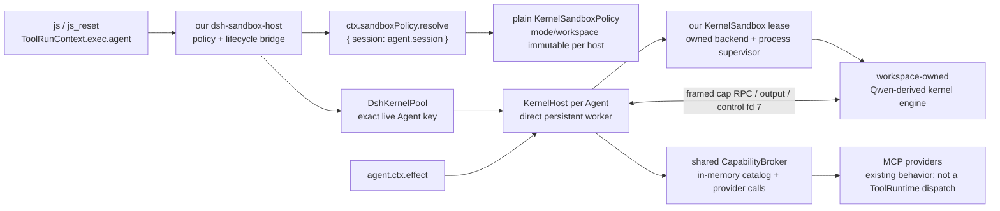

# Owned kernel sandbox 与可选 DSH bridge 的实施方案（后续阶段待确认）

> **状态：设计仍待确认；Phase 0 的独立非生产验证已开始。** 本文仍记录推荐设计、前置验证和改动边界；本轮只新增
> `verify/windows-acl/` 下不发布的验证器，未修改 runtime、adapter、bootstrap、默认 profile 或 DSH checkout 的运行行为。
> 任何 production migration / optional host 接线仍须单独确认。
>
> **2026-10-02 Phase 0 执行记录：** Tier 00 的 own、unconfined fd 7 transport fixture 已通过；Tier 10 的固定 DSH
> source reference baseline 已通过；Tier 10 native preflight 刻意以 `UNSUPPORTED` / exit `2` fail closed。Windows ACL 的
> `read-only` 与 `workspace-write` 仍均为 **unsupported**，不能启用 `sandboxHost: 'required'`。完整证据、non-claims 与
> 后续 gate 见 [`verify/windows-acl/evidence/RESULTS.md`](../verify/windows-acl/evidence/RESULTS.md)。
>
> **结论先行（修订提案）：** 经 DSH bridge 使用的 owned sandbox 是**显式可选的 host mode**，不是 runtime 的默认
> 依赖，也不是所有 `node_repl` 用户必须面对的 DSH fork / plugin 问题。默认 host 保持现有的
> standalone / 普通 DSH 路径；只有部署明确选择 `sandboxHost: 'required'` 时，才加载我们维护的
> `node-repl-dsh-sandbox-host`。该包只读取 DSH 的 Agent / session policy 并绑定生命周期；**它不调用
> `ctx.sandbox` / `ctx.subprocess`，也不要求修改或 fork DSH。**
>
> 在这个 opt-in mode 中，不应把 `confine()` 简单塞进当前 Qwen outer MCP server 的
> `StdioClientTransport` 调用。正确目标是：**将 Qwen 的可复用执行 engine，以及窄的、kernel 专用
> OS sandbox / direct-worker process supervisor 迁入本仓库；由我们自己的 sandbox lease 启动实际
> persistent worker。** DSH 只提供 live Agent、workspace 和 mode；每个 live Agent 获得一个受策略绑定的
> KernelHost，provider broker 保持宿主侧共享。这样取消 outer-MCP-server → inner-worker 的嵌套进程链，
> 消除 Qwen 当前 startup 对 host `/tmp` scratch 和 Windows nested-pipe 的依赖；也不会把 DSH backend
> 的维护债务转移给默认用户或私有 DSH fork。
>
> **团队复审结论（本轮）：仅条件批准 Windows-first、非发布的 Phase 0。** Phase 0 必须先证明本项目拥有的
> Windows restricted-token handoff、lifecycle、environment 和 fd contract；在所有 Phase 0 hard gate 通过前，
> **不**开始 engine/runtime 迁移、不发布 Windows `sandboxHost: 'required'`、不改变默认 host，也不修改
> DSH core/fork。本文后文的 Phase 1–4 是通过 gate 后的路线图，不是自动获批的实施授权。

---

## 0. 本次需要确认的决定

### 推荐路径：A（正确的按 owner 隔离）

| 选择 | 说明 | 推荐度 |
| --- | --- | --- |
| **A. Agent-owned KernelHost** | 每个 live `Agent` / session 获得独立的常驻 direct worker；创建时固定 plain `KernelSandboxPolicy`，`agent.ctx` dispose 时清理。provider catalog/broker 可共享。 | **推荐** |
| B. 进程级单一 kernel + 全局固定 sandbox policy | 保留现有跨 session 绑定，但只能在 bootstrap 时用无 session 的默认 policy；每个 session 的 `cwd` / sandbox mode 都不能可靠生效。 | 仅适合明确的单 workspace 专用部署 |
| C. 只把 wrapper argv 传给现有单一 kernel | 看似改动最小，但 policy owner 错位，并在 read-only、Linux bwrap、Windows ACL 上有已知启动阻塞。 | **拒绝** |

A **只适用于显式启用的 sandbox host**。它接受一个有意的生命周期变更：在 sandbox mode 中，一个 live Agent
有一个 kernel，`var` / page / handle 不泄露到另一个 Agent。**未启用时不改变当前语义**：仍是一 DSH process
一个普通 host、跨会话 binding 保持、也不要求调用带 `exec.agent`。

因此 [`docs/06-kernel-boundaries.zh-CN.md`](06-kernel-boundaries.zh-CN.md) 的历史决定不会被静默推翻：它继续描述
默认 host；确认 A 后，06/07 只需增加“sandbox host 是显式例外”的记录，而不是把所有 DSH 用户迁到按 session
内核。

### 同时请确认的边界

1. **是否接受 sandbox host 默认为关闭。** 不加载 sandbox-host package / profile patch 就是普通 runtime：不解析 policy、不创建 sandbox lease、不需要私有 DSH fork，也不改变 global-kernel 语义。拒绝 `auto`：它会让同一配置在不同 DSH 安装上悄悄改变安全和生命周期语义。
2. **是否接受 owned Qwen-derived engine 与 owned kernel sandbox。** 将 Apache-2.0 Qwen 的可复用 worker engine，以及 DSH 中与 direct worker 有关的窄 sandbox/process 实现迁入本仓库、以 provenance ledger 维护；DSH TypeScript source 多为 MIT，但 Landlock native helper 是 BSD-3-Clause，且所有第三方 native/npm 许可证都须逐项保留。不得把个人 Qwen fork 或 DSH fork 写成发布依赖，也不迁入 Qwen outer MCP server / inner-worker manager 或 DSH 的完整工具/PTY/终端体系。
3. **是否接受 DSH 只做 opt-in policy/lifecycle bridge。** `node-repl-dsh-sandbox-host` 只使用已公开的 Agent、session 与 policy API，把 mode/workspace 映射为我们的 `KernelSandboxPolicy`；**v1 不改 DSH core、不维护私有 DSH fork。** 平台 backend 不通过时由我们的 sandbox host 明确不支持，而不是推动 DSH fork。
4. **是否接受 `js_reset` 仅在 sandbox host 中变为“释放当前 owner 的整个 KernelHost，下一次 `js` 懒启动”。** 这样 reset 才能在 sandbox mode / workspace 变动后以新 policy 重建 direct worker；默认 host 继续保留现有 reset 语义。
5. **是否以“已声明支持的 backend × mode 全部通过”为 sandbox host 的启用门槛。** 推荐是“是”：尚未移植或验证的平台（例如 Windows ACL）不发布该 sandbox-host 组合，`required` 明确失败，绝不静默回退到未沙箱的 Node。

本轮 Phase 0 只增加 standalone `verify/windows-acl/` 验证器与相关证据文档；不进入 `packages/*` workspace，且不改变 runtime / adapter / bootstrap / DSH profile。其余 formal implementation 仍须逐阶段确认。

### 0.1 默认路径与 opt-in 路径的契约

sandbox 不是一个在普通 bootstrap 内“检测到 DSH 就自动打开”的布尔分支；它是一个**单独安装 / 单独加载的
host implementation**。建议对外只暴露两个静态 profile 选择：

| 部署选择 | 加载内容 | 用户得到的语义 | 对 DSH fork / sandbox plugin 的要求 |
| --- | --- | --- | --- |
| **默认（`sandboxHost: 'disabled'`）** | 现有 `node-repl-dsh-bootstrap` + `node-repl-dsh-adapter`，或 standalone runtime/CLI。 | 当前普通 host：process-level kernel、现有 reset、没有 session-policy fence。 | **无。** 不 import kernel-sandbox 或 sandbox-host package，不读取 `ctx.sandbox*`，不要求 `exec.agent`，也不受 DSH backend 是否存在影响。 |
| **显式 sandbox（`sandboxHost: 'required'`）** | common two-tool face + 我们发布的 `node-repl-dsh-sandbox-host` package/profile patch；与普通 host **二选一**。 | Agent-owned direct worker、session policy fence、whole-host reset、non-danger fail closed。 | 需要已声明的 DSH public Agent/session/policy peer API；OS sandbox 由本项目的 `kernel-sandbox-*` 包实现。**不需要 DSH fork。** |

`required` 不是“尽量 sandbox、失败就照常跑”的含义：sandbox-host package 缺失、DSH policy bridge 缺失、
我们的 runner / control channel 不可用，或当前 backend × mode 未列入支持矩阵时，应在 profile load 或第一次 `js`
给出明确诊断，且**不得切换到普通 raw Node host**。

为避免同名 `js` / `js_reset` 被两个 plugin 重复注册，两个 host 必须通过同一个抽象 `NodeReplExecutor`
服务被 common face 消费，或由两个互斥 bundle patch 分别注册 face；不能让普通 bootstrap 与 sandbox host 同时
提供同一个 service。推荐前者：face 只依赖 executor，默认 host 的 executor 忽略 `ToolRunContext`，sandbox host
的 executor 使用 `exec.agent`。

概念配置如下；具体 Cordis patch 语法在实施时按 profile API 落定：

```yaml
# 默认：所有现有用户继续使用，不出现 sandbox 依赖
- name: '@lyd123qw2008/node-repl-dsh-bootstrap'
- name: '@lyd123qw2008/node-repl-dsh-adapter'

# sandbox：部署者明确替换 host；不得与上面的普通 bootstrap 同时启用
- name: '@lyd123qw2008/node-repl-dsh-sandbox-host'
  config:
    sandboxHost: required
- name: '@lyd123qw2008/node-repl-dsh-adapter'
```

这里的“可选”是**包与 profile 边界**，不是 `try/catch` 后降级：普通 bootstrap 不把 sandbox-host 或
`kernel-sandbox-*` 写入 `dependencies` / bundle patch，也不根据 `ctx.get('sandbox')` 的存在动态改变执行器。
`sandbox-host` 只声明 DSH Agent/session/policy 的 public peer/version range；**你的 DSH fork 不是部署 target，
也不出现在该方案的依赖图中。**

#### DSH bridge 的最小兼容性条件

opt-in profile 必须明确检查并注入 `tools`、公开的 Agent/session 类型及 `sandboxPolicy` resolver；现有 DSH base
bundle 通常已挂载该 policy service（例如 base patch 的 `sandbox-policy` entry），但这只是 bridge 的**policy 来源**。
它不表示本项目调用、探测或依赖同一 bundle 中的 `ctx.sandbox` / `dsh-sandbox-local` / `ctx.subprocess` backend。
实现前要以目标 DSH 发布版做 compile/load probe，确认：

- `ToolRunContext.agent`、`Agent.session` 与 `agent.ctx.effect()` 的类型/生命周期契约满足 bridge；
- `sandboxPolicy.resolve({ session })` 可取得绝对 workspace 和三态 mode；
- profile 缺失 policy service 时，`sandboxHost: required` 在加载或首次调用报配置错误，而不是从 `ctx.get()` 猜测、
  挂到 default host 或调用 DSH local runner；
- DSH policy package自己的 published peer layout 即使间接要求 sandbox vocabulary package，也不得被误描述为
  `node-repl` 使用 DSH sandbox **backend**。普通 default profile 完全不加载 bridge，因此不受此条件影响。
- `dsh-sandbox-host` 的 `package.json` 必须只声明经验证的**public root export**对应 peer range；禁止
  `@deepseek-ai/*/src/*` deep import，禁止依赖 checkout workspace resolution。发布 gate 用 `pnpm pack` / clean
  consumer install 分别 typecheck 和 load：`ToolRunContext.agent`、`Agent.session`、`agent.ctx.effect()` 与
  `sandboxPolicy.resolve()` 都必须来自支持版本的已安装 package。
- DSH host/adapter/bootstrap 必须共享一个匹配的 Cordis 与 DSH peer identity；不能让 optional host 因 nested
  dependency 带入第二份 Cordis，造成 Context augmentation / service token 不相等。支持矩阵列出实际验证的
  DSH/Cordis version，而不是从本地 checkout 的源码版本推断兼容。

### 0.2 谁需要改、改在哪里

这不是“给 [`packages/runtime/src/kernel.ts`](../packages/runtime/src/kernel.ts) 的 spawn 加一行 wrapper”就能完成的功能。责任分为以下几方：

| 责任方 | 仓库 / 现有入口 | 需要改什么 | 是否实现 sandbox 的必需项 |
| --- | --- | --- | --- |
| **本仓库：Qwen-derived engine** | 新建 `packages/kernel-engine/`（建议名称） | 从 Qwen 的 worker runtime、module loader、cell transform/binding、output/protocol 中迁入可复用部分；去掉 outer MCP server、inner-worker manager 和其 `/tmp` session directory 假设；将协议改为一个 host-owned duplex control channel。保留 Apache-2.0 来源、版权头、license/provenance ledger。 | **engine migration 的核心；关闭 sandbox 不要求安装任何 DSH integration** |
| **本仓库：kernel sandbox core** | 新建 `packages/kernel-sandbox-core/` | 定义 DSH-free 的 `KernelSandboxPolicy`、`SandboxLease`、enforcement/denial/runner diagnostics、canonical roots 与生命周期约定；`lease` 对一个 persistent worker 而非任意 shell command 负责。 | **opt-in sandbox 的核心；普通用户不安装** |
| **本仓库：local platform backends** | 新建 `packages/kernel-sandbox-local/`，按需新建 `packages/kernel-sandbox-windows-acl/` | 从 DSH source **窄迁入** bwrap/Landlock/Seatbelt profile + functional probes，以及（仅 Windows 支持时）restricted token、SID/DACL/Low integrity/Job/fd-7 路径和 ABI probe。DSH TypeScript files 多为 MIT；Landlock native helper 为 BSD-3-Clause，另行清点 Koffi / native/npm 许可证。保留来源文件版权头、全部 license notices、source manifest 和上游回归测试；不迁 DSH plugin、policy、tool/PTY/terminal 体系。 | **仅已声明的 sandbox backend × mode 必需** |
| **本仓库：direct-worker supervisor** | 新建 `packages/kernel-process-supervisor/`（建议名称） | 只管理 persistent worker 所需的 spawn、fd 7 duplex、bounded stderr、cancel、kill/wait process range；从 DSH subprocess / Win32 process 窄迁必要代码与测试。Windows v1 还迁其 private Job runner IPC / carrier-fd / result-settlement 模式，并改接 owned restricted-token backend；不复制 shell/PTY/activity API。 | **opt-in sandbox 必需；可由普通 direct-engine launcher复用** |
| **本仓库：通用 runtime** | [`packages/runtime/src/types.ts`](../packages/runtime/src/types.ts)、[`kernel.ts`](../packages/runtime/src/kernel.ts)、[`index.ts`](../packages/runtime/src/index.ts)、现有 `assets/nr-cap/` | 拆出 `CapabilityBroker` 与 `KernelHost`；以 direct worker transport 替代 outer Qwen MCP client；将 `nr-cap` 的 catalog/call/reconnect 协议从 config-file + loopback TCP 收归 host↔worker control channel；保留 DSH-free standalone facade 和普通 local launcher。 | **通用演进；不依赖 DSH sandbox package** |
| **本仓库：optional DSH sandbox host** | 新建 `packages/dsh-sandbox-host/`，发布名 `@lyd123qw2008/node-repl-dsh-sandbox-host`；[`packages/adapter-dsh/src/index.ts`](../packages/adapter-dsh/src/index.ts) 仅抽出 common executor face | 只在显式 profile 加载时，从 `exec.agent` 取得 owner，以已有 `sandboxPolicy.resolve({ session })` 映射 mode/workspace；按 exact live Agent 管理 `KernelHost`，通过 `agent.ctx.effect` 关闭，并调用**本仓库** sandbox lease / supervisor 直接启动 worker；agentless 调用拒绝。现有 `dsh-bootstrap` 继续提供普通 executor，不 import 此 package。 | **只对 `sandboxHost: 'required'` 必需** |
| **本仓库：可行性验证** | `packages/kernel-sandbox-*/tests/`、`packages/dsh-sandbox-host/tests/` 或不发布的 `verify/` harness | 先对 owned backend 跑 backend × mode 矩阵，再验证 DSH policy bridge / Agent cleanup；验证 control fd 7、reset、cap RPC、worker cleanup 和文件边界。 | **只在 opt-in host 的第一步必需** |
| **DSH public API（不修改）** | 已有 Agent、ToolRunContext、`sandbox-policy` service | 仅被 optional host 作为 peer API 消费：提供 live owner、session workspace/mode 与 scope dispose；不得 import DSH 的 local sandbox/subprocess implementation。 | **仅 opt-in bridge 所需；不需要 fork** |
| **DSH sandbox / Windows ACL / subprocess source** | [`packages/sandbox/`](../../deepseek-harness/packages/sandbox/)、[`packages/subprocess/`](../../deepseek-harness/packages/subprocess/)、[`native/system/`](../../deepseek-harness/native/system/) | 作为来源与回归证据：DSH TypeScript 多为 MIT，Landlock helper 为 BSD-3-Clause，第三方 native dependency 另行盘点；必要机制迁入并在本仓库维护。**v1 不修改这些文件，也不把它们作为 runtime dependency。** | **不需要改** |
| **Qwen 上游 / 个人 fork** | 无 runtime 依赖；只保留 provenance / upstream sync 来源 | 不把 `@qwen-code/node-repl-mcp` 或个人 Qwen fork 固定写进发布依赖。后续可按 patch ledger 手动吸收上游修复或回馈 PR。 | **任何 mode 都不需要作为部署依赖** |
| **部署 profile** | [web profile](<D:/liuyd/code/dsh-home-v0.2.0-rc.2/profiles/web/cordis.patch.yml>)、[desktop profile](<D:/liuyd/code/dsh-home-v0.2.0-rc.2/profiles/desktop/cordis.patch.yml>) | 现有普通 profile 保持不变；另发一个**可选** sandbox-host patch，由部署者明确加载并取代普通 host entry。不得自动替换 production wiring。 | **只在用户选择启用时安装/加载** |
| **外部 MCP provider（IDEA/Chrome/CUA 等）** | 不改 | broker 继续使用既有 provider 连接；本 feature 不改变 provider 接口和业务授权。 | **不需要改** |

#### 本项目包的所有权与发布边界

下列包都放在 `D:\\liuyd\\code\\node-repl-runtime\\packages\\`，由我们发布和维护；以下是**建议发布名**。
`dsh` 出现在包名中只表示它是 Cordis/DSH 的适配层，不表示它由 DSH 仓库维护：

```text
kernel-engine/                 @lyd123qw2008/node-repl-kernel-engine
kernel-sandbox-core/           @lyd123qw2008/node-repl-kernel-sandbox-core
kernel-sandbox-local/          @lyd123qw2008/node-repl-kernel-sandbox-local
kernel-process-supervisor/     @lyd123qw2008/node-repl-kernel-process-supervisor
dsh-sandbox-host/              @lyd123qw2008/node-repl-dsh-sandbox-host
kernel-sandbox-windows-acl/    @lyd123qw2008/node-repl-kernel-sandbox-windows-acl  # later / only if supported
```

普通 `dsh-bootstrap`、common `adapter-dsh`、generic runtime 和 CLI 不应把这些 optional sandbox packages 打入
默认 bundle。`dsh-sandbox-host` 才是唯一允许对 `@deepseek-ai/*` Agent/session/policy peer API 有编译期依赖的
包；它不拥有或转发 DSH sandbox/subprocess backend。

#### 维护责任矩阵（避免把完整 DSH fork 偷渡进来）

| 选择 | 长期谁维护 | 代价 / 风险 | 本方案结论 |
| --- | --- | --- | --- |
| 直接继续调用 DSH `ctx.sandbox` + `ctx.subprocess` | DSH upstream；若功能缺口则我们还需维护 fork/patch | 初始最省事，但 persistent worker 的 fd、Windows runner 和 DSH API 变更会把发布节奏绑到 DSH；普通用户也容易被隐式依赖影响。 | **不选。** |
| 整套复制 DSH sandbox / subprocess | `node-repl-runtime` | 连 Cordis service、session policy、skills、PTY、terminal、shell activity 一起背下来；多数代码与 Node worker 无关，安全回归面过大。 | **不选。** |
| **窄迁入 kernel 专用 substrate** | **`node-repl-runtime`** | 初始提取和平台测试成本中高，但边界可控：仅 confinement、direct-worker process range、fd 7、diagnostics 和必要 native backend。 | **选用。** |
| 改用容器 / microVM / remote executor | 未来独立 execution platform | 隔离更强，但改变 workspace、provider connectivity、启动性能和产品部署模型；不是此 persistent Node feature 的等价替代。 | 本文不实施。 |

实际责任必须严格分开：

| 领域 | 责任方 | 不承担什么 |
| --- | --- | --- |
| `kernel-engine`、`kernel-sandbox-*`、`kernel-process-supervisor`、平台安全回归、third-party notices | 本项目 | 不依赖 DSH runtime backend，也不以 DSH fork 代替 regression。 |
| `@lyd123qw2008/node-repl-dsh-sandbox-host` | 本项目 | 只桥接 live `Agent` / session mode / workspace 与 scope disposal；不实现 sandbox runner。 |
| Agent/session/policy public API 的稳定性 | DSH upstream | 不负责本项目的 worker spawn、fd 7、ACL 或 bwrap 行为。 |
| 启用哪个 profile、接受哪些 backend × mode | 部署者 | `required` 模式下不可用时不得要求系统悄悄放宽为 raw Node。 |

平台维护也必须按已验证能力发布，而不是“复制了代码就声称支持”：Linux 的 bwrap 与 Landlock 分别探测和回归；
macOS Seatbelt 要保留其已弃用的现实限制；Windows ACL 只有在 restricted token、DACL、Low integrity、Job、fd 7
CRT descriptor table 和 ABI probe **全部**迁入并在 Windows CI 真机通过后，才可列入发布矩阵。否则 v1 将该项标为
unsupported，而不是再次把维护责任推给 DSH。Landlock 路径不得在发布包中继续以
`@deepseek-ai/node-addon-system` 作为隐式 DSH runtime dependency：要么迁入其 BSD-3-Clause launcher source 并由
本项目打包/测试，要么换成可独立 pin 的上游 launcher；Windows 可显式 pin `koffi` 等第三方依赖，但同样不能借由
DSH workspace package 间接取得 native process 实现。

#### 依赖方向（必须保持单向）

```text
Qwen upstream (Apache-2.0) ───────────────────────────> kernel-engine
DSH sandbox/subprocess/native source
  (MIT / BSD-3-Clause / audited deps) ────────────────> kernel-sandbox-* + kernel-process-supervisor

kernel-engine + owned sandbox/supervisor ────────────> generic runtime ──> local/default host ──> CLI / 普通 DSH 用户
                                                         │
                                                         └──> optional dsh-sandbox-host ──> DSH public Agent/session/policy bridge

DSH source only supplies pinned provenance and the bridge's public peer API;
it is neither a modified checkout nor a runtime backend dependency.
```

也就是说，engine 与 kernel sandbox 可被本仓库完全拥有和定制；普通 local/default host 不知道 DSH sandbox
存在。`dsh-sandbox-host` 是我们发布、我们维护的可选宿主适配包：它只映射 policy/lifecycle，不能反向让
generic runtime 或默认用户 import DSH sandbox implementation。

#### 按范围看，实际是三种项目

```text
默认用户
  → 继续使用 generic runtime + local/default host；不安装、不加载 sandbox-host 或
    kernel-sandbox-*，不关心 DSH fork、backend 能力或 session policy。

Phase 0：owned kernel-sandbox extraction spike
  → 从固定 DSH source（含其各自许可证）做不发布的、direct-worker 专用窄提取，先独立验证
    backend × mode、fd 7、process cleanup；不改变 DSH、默认 profile 或线上普通 host。

Engine / sandbox migration + optional DSH bridge
  → 主要改 node-repl-runtime：Qwen worker engine、kernel sandbox 与 worker
    supervisor 都在本仓库；default host 与 sandbox host 都可选择 engine，但只有后者
    创建受策略约束的 worker；DSH bridge 只消费 public policy/lifecycle API。

未支持的 backend × mode
  → 在我们的 sandbox host 中明确 unavailable；不改 DSH backend、不维护 DSH fork，
    也不回退普通 Node。Qwen / DSH upstream 都只作同步来源。
```

所以新的推荐分界线是：**先只批准 owned kernel-sandbox extraction spike。** 它验证“我们能否承担需要的
平台 backend”，而不是假设 DSH 必须配合；在 spike 通过前，不启动 engine migration，也不改默认 profile。

---

## 1. 现状与必须尊重的事实

### 1.1 当前 runtime 的创建点没有 session

[`packages/dsh-bootstrap/src/index.ts`](../packages/dsh-bootstrap/src/index.ts) 在 Cordis plugin `apply()` 时一次性调用 `createCapabilityRuntime()` 并 `ctx.provide('nodeReplRuntime', runtime)`。而 [`packages/runtime/src/index.ts`](../packages/runtime/src/index.ts) 在 runtime 创建期间：

1. 连接 provider；
2. 启动 loopback bridge；
3. 创建 scratch root；
4. 立即调用 `startKernel()`；
5. 返回一个 process-level `CapabilityRuntime`。

此时没有 `ToolRunContext`，自然也没有 `exec.agent.session`。这对**默认 host 是正确且保持不变的**：它本来就不承诺按 session sandbox。只有把 `ctx.sandboxPolicy.resolve()` 放到 optional sandbox host 的 cell-time owner 创建路径，才能得到调用 `js` 的 session policy；放在这里最多得到 deployment 默认 policy。

DSH 的 policy 本来就是按 session 解析的：[`sandbox-policy/src/index.ts`](../../deepseek-harness/packages/sandbox/sandbox-policy/src/index.ts) 的 `resolve({ session })` 从 session header 取得 workspace，并折叠 session 的 `sandbox/mode` 覆盖。

### 1.2 DSH 已有正确的 persistent-resource ownership 模式

模型触发的 DSH tool 在 [`ToolRunContext`](../../deepseek-harness/packages/core/tools/src/index.ts) 中通过可选的 `exec.agent` 获得 owner；真正的 session 是 `exec.agent.session`。现有持久 bash 在 [`tool-bash-persistent/src/index.ts`](../../deepseek-harness/packages/shell/tool-bash-persistent/src/index.ts) 明确拒绝 agentless 调用，而不是偷偷回退到全局 shell。

[`experimental/browser-use-runtime/src/index.ts`](../../deepseek-harness/packages/experimental/browser-use-runtime/src/index.ts) 的 `SessionResources<T>` 是应复用的模式：

- 用**精确 live Agent 对象**作为 `Map` key，而不是只用可复用的 session id；
- 按 owner 串行化操作；
- 首次获取资源时注册 `agent.ctx.effect(() => async () => close())`；
- Agent scope dispose 会等待 cleanup，因而它才是受管资源的 quiescent 生命周期边界；
- 不把 fire-and-forget 的 `session/disposed` event 当作唯一的杀进程机制。

DSH terminal backend 还已有持久进程与 mode 的判据：[`terminal-bash/src/index.ts`](../../deepseek-harness/packages/terminal/terminal-bash/src/index.ts) 以 owner session 解析 policy，并在持久 terminal 活着时拒绝切换 sandbox mode。**optional sandbox host** 应遵循同一原则；默认 node_repl 不被强行改造成该语义。

### 1.3 迁入 DSH sandbox 的正确边界：机制归我们，policy bridge 留在 DSH

DSH 的 `SandboxProvider.confine()`、local profiles、Windows ACL runner 与 `ctx.subprocess` 是很好的
**机制来源和测试证据**，但不应成为 `node_repl` 的长期 runtime backend 依赖。已核验的 DSH TypeScript
packages（`dsh-sandbox`、`dsh-sandbox-local`、`dsh-sandbox-windows-acl`、`dsh-subprocess`、
`dsh-subprocess-local`）与根许可证是 MIT；不过 Linux Landlock 路径依赖的
`@deepseek-ai/node-addon-system` native helper 是 BSD-3-Clause。迁入时必须保留每个来源的版权/许可证、
第三方 native dependency inventory 和 source manifest；不能只复制编译后的 `lib` 或 `node_modules` 产物。

我们自己的公开边界应改为适合一个长寿 worker 的 lease，而非每次 shell command 的 service：

```ts
interface KernelSandboxPolicy {
  readonly mode: 'read-only' | 'workspace-write' | 'danger-full-access'
  readonly workspaceRoot: string
  /** Random, non-reusable live-host identity; no DSH SessionId type leaks in. */
  readonly ownerKey?: string
}

interface SandboxLease {
  readonly enforcement: 'full' | 'partial'
  readonly diagnostics: KernelSandboxDiagnostics
  /** One persistent KernelHost owns one lease and may start exactly one worker. */
  spawnWorker(request: KernelWorkerRequest): Promise<KernelWorkerHandle>
  /** Only callable after its worker has reached treeExited. */
  dispose(): Promise<void>
}

interface KernelSandbox {
  acquire(policy: KernelSandboxPolicy, signal?: AbortSignal): Promise<SandboxLease>
}
```

- `read-only` 不授予写入；`workspace-write` 授予 workspace 与 backend 明确记录的私有区域；
  `danger-full-access` 不获取受限 lease，必须明确显示为未加文件限制；
- 不存在 runner、probe 失败或 backend × mode 未支持时，**我们的** `KernelSandbox` 必须 fail closed；
- Windows ACL package 是 `partial` enforcement：写/删受限，但读、网络和进程可见性不受完整约束，且有硬链接/
  AppContainer 边界；这些事实必须随迁入测试和文档保留；
- DSH optional bridge 只把 `sandboxPolicy.resolve({ session })` 的 mode/workspace 映射进上面的 plain policy，
  不 import `ctx.sandbox`、`ctx.subprocess`、DSH runner 或 DSH backend implementation。

因此本项目接入后仍然**不**声称：

- `fetch` / `net` 有 egress allowlist；
- `cap.*` 经由 DSH ToolRuntime 的 ask/approval/guard；
- provider 自己的进程或远端服务被这个 kernel sandbox 约束；
- Windows 上读取其他路径被阻止。

当前 `cap.*` 通过 runtime 的 loopback host bridge 直接走已连接 provider；direct-engine 迁入后它通过 host-owned
control frame / broker 走同一类 provider 调用。两种 host mode 均不把它变成 DSH ToolRuntime dispatch；本方案仅
在 opt-in sandbox host 中约束模型 cell 可直接获得的 Node/OS 文件效果，provider authorization 是另一个议题。

### 1.4 为什么迁入 Qwen engine 比维护 Qwen fork 更合适

当前 [`packages/runtime/src/kernel.ts`](../packages/runtime/src/kernel.ts) 用 MCP SDK 的 `StdioClientTransport` 启动
`@qwen-code/node-repl-mcp` outer server；该 server 又通过 `kernel-manager.js` 启动真正执行 cell 的 worker。
这个“outer MCP server → inner worker”的包装层才是 sandbox 复杂度的主要来源：它建立 host-temp
`nr-cap/config.json`、outer stdio、inner 五路 pipe、session tmp directory 和另一个进程生命周期。

真正值得复用的是 Qwen 的**执行 engine**，而不是其 outer MCP 适配器。可迁入的范围包括：

- persistent cell binding / transform / rollback 语义；
- vm context、module loader、top-level `await` 和 cancellation；
- output/image budget、timer 与 generation 管理；
- host↔worker frame protocol 的健壮解码逻辑；
- capability namespace 的 plain-object catalog 语义（但 transport 改成 inherited control channel）。

不迁入的范围包括：

- `index.js` / `mcp-server.js` 的 MCP tool facade；
- `kernel-manager.js` 的“再起一个 inner worker”生命周期；
- config-file + loopback TCP `nr-cap` bridge；
- host `/tmp` 下的 transient asset root 与 session tmp directory 作为启动前提。

Qwen package metadata 和其 `LICENSE` 标明 Apache-2.0。迁移必须从已固定的**上游 source tag/commit**取源，
而不是复制 `node_modules/dist` 作为唯一来源；保留每个来源文件的版权/SPDX 头、Apache-2.0 license，
检查并保留上游 `NOTICE`（若存在），并新增 `UPSTREAM.md` / patch ledger 记录原始路径、commit、迁移日期和本地修改。
这让我们拥有可定制 engine，但不把个人 Qwen fork 变成产品的发布依赖。对 DSH-derived sandbox/process
文件采用同一纪律，但它们的许可证是 MIT：建议统一维护 `THIRD_PARTY_NOTICES.md`、`UPSTREAM.md` 和
per-file source manifest，分别记录 Qwen Apache-2.0、DSH TypeScript MIT、Landlock helper BSD-3-Clause、Koffi/其他 native npm 依赖及 DSH ACL 所引用外部 POC（先核验 license/attribution）的原始路径、pin、迁入日期、测试来源和本地 patch。

---

## 2. 迁入 direct worker / kernel sandbox 后的约束与待验证点

以下是**旧 outer-Qwen 路径**的已知 blocker，以及 owned direct-worker sandbox 如何处理它们。它们必须由
我们迁入的 backend 与测试验证；不再自动等价于“要改 DSH”。

| 场景 | 旧路径的问题 | owned direct-worker 设计与剩余风险 |
| --- | --- | --- |
| **所有平台的 `read-only`** | Qwen outer manager 会先创建 `os.tmpdir()/qwen-node-repl/...`。 | engine 不应以磁盘 temp 作为启动前提：cell virtual module 本来在内存中创建。`nodeRepl.tmpDir` 若保留，必须是 `SandboxLease` 明确提供的可选功能，不能在 read-only 下偷开写权限。需测试 read-only 首 cell / reset。 |
| **Linux bwrap + `workspace-write`** | host `/tmp` 内生成的 `nr-cap` root 被 bwrap 的 fresh `/tmp` tmpfs 遮蔽。 | 取消 generated `nr-cap` root：worker entry 从已安装的 engine package启动，owned bwrap profile 要验证 package/cwd/module resolution；若 `/tmp` 做 tmpfs，不能把 worker asset/token 放进去。 |
| **Windows ACL + startup** | 受限 outer server 不能以 `stdio: 'pipe'` 再起五路-pipe inner worker。 | Qwen outer MCP/manager 被移除，engine worker 是最终**执行 payload**；但现有 DSH ACL primitive 只在 `stdio: 'inherit'` 分支支持 control fd 7，piped-stdio 分支不能同时交付 control。Windows v1 推荐迁入 DSH `subprocess-local` 的**私有 Job runner protocol**：runner IPC 与 target stdin/stdout/stderr carriers 分离，fd 7 传给最终 worker；将 current-token Job spawn 改为 restricted-token Job spawn。runner 只在 target result 已报告且 `isJobEmpty()` 后退出，因此 host 可获得 quiescence 事实。这个 restricted path 还必须实证 target carriers、frozen per-lease env/`TMP/TEMP`、native handle allowlist、CRT fd 7 与 Job ownership 真正抵达最终 worker；不能只复用简单 ACL argv runner，它只有 inherited-stdio + fd 7，未给出 host-side piped-output/Job-settlement protocol。未来可再把 runner 优化为 host-owned single native spawn。不得把“没有 Qwen outer server”误写成“Windows 上绝无 trusted transport runner”。所有路线都必须携带 DSH 来源的 native ABI / ACL regression tests。 |
| **Windows ACL + cell 自行起子进程** | 现有 backend 会拒绝受限 Node 的 `spawn({ stdio: 'pipe' })` grandchild。 | 这是迁入后仍应保留并披露的 backend 限制，direct worker 不会神奇消除它。browser/IDE provider RPC 不依赖此能力；模型需要 piped child process 时应得到诚实的 EPERM/能力说明。 |
| **Desktop / Electron + Windows ACL** | outer payload 和 ACL runner prefix 可能误用 `electron.exe`。 | owned supervisor 的 API 必须显式要求 real Node executable；禁止从 Desktop `process.execPath` 猜测。Windows source-derived Job path需测试 real Node、fd 7 和 reset。 |
| **进程树、stderr 与 runner diagnostics** | `StdioClientTransport` 直接 `cross-spawn`，没有 managed range / exit facts。 | `kernel-process-supervisor` 仅实现 worker 所需的 bounded stderr、outcome、terminate / wait-for-range、runner diagnostics；不复制 DSH 的 shell/PTY/activity surface。 |

Windows 文件 sandbox 仍必须如实标为 `partial`：它限制写入/删除，不限制读取、网络或进程可见性，并有硬链接/
AppContainer 边界。迁入时以 [`sandbox-windows-acl/README.zh.md`](../../deepseek-harness/packages/sandbox/sandbox-windows-acl/README.zh.md)
及其源测试作为证据，重新在本仓库执行等价测试。

**因此新路线不是“让 DSH 拥有真正执行代码”，而是让 `node-repl-runtime` 拥有 sandbox 和真正执行代码；DSH
只在可选模式提供 policy/lifecycle bridge。** 旧路线的 Qwen nested-pipe、host-temp asset root 和 outer-MCP
transport 均可架构性移除；仍不能把 Windows 子进程 pipe 限制、网络 egress 或 provider authorization 宣称为已解决。

---

## 3. 目标架构

下面的图**只描述 `sandboxHost: 'required'`**；默认 host 仍是 `CapabilityRuntime` → 普通 local launcher →
一个 process-level `KernelHost`，不进入这个 Agent / policy / sandbox-lease 图。



### 3.1 拆分现有 runtime 的责任

现有 `createCapabilityRuntime()` 将 provider、bridge、kernel host 绑为一个对象。为了让 sandbox lifetime 对齐 owner，实施时拆成三个内部层：

| 层 | 生命周期 | 职责 |
| --- | --- | --- |
| `kernel-engine`（新 workspace package） | 一个 worker process | 迁入 Qwen-derived cell execution、binding、module loading、output 与 frame protocol；只接受一个抽象 duplex transport，不导入 Cordis/DSH/MCP/provider。 |
| `kernel-sandbox-core` / platform backend | 一个 `SandboxLease` | 将 plain policy 变成真实 platform confinement、enforcement/diagnostics 和资源清理；Windows lease 还拥有 private-temp / DACL grants。无 DSH SessionId/Cordis 类型。 |
| `kernel-process-supervisor` | 一个 direct worker / process range | 为 engine 分配 fd 7 duplex、bounded stderr、outcome、idempotent terminate 与 quiescent `waitForExit`；它先终止/等待完整 process range，再允许 lease 撤销权限。平台实现只覆盖 worker 需要的子集。 |
| `CapabilityBroker` | bootstrap / app | 连接 provider、维护 catalog 和 unattached 状态，并以普通内存方法服务 capability call/catalog/reconnect；不再启动 loopback TCP bridge。所有 in-flight state 都按 host nonce + worker generation + cell id + request id 归属，绝不复用旧的 global-abort 语义。 |
| `KernelHost` | 由 host implementation 决定 | 通过 normal launcher 或 `SandboxLease.spawnWorker()` 管理**一个直接 worker**、其 generation、`js` / reset / close，并将 engine cap-RPC 转发给 broker。它没有 DSH/session 类型。 |
| `LocalNodeReplExecutor`（默认） | app / process | 用普通 local launcher 和一个普通 `KernelHost` 适配现有 `CapabilityRuntime`；忽略 `ToolRunContext`，保持 process-level binding / reset 语义。 |
| `DshSandboxNodeReplExecutor`（可选） | 一个 live Agent | 只在我们发布的 `node-repl-dsh-sandbox-host` 中存在；用 `Map<Agent, Entry>` 管理 lazy `KernelHost`，以 DSH public policy 映射取得 plain policy，注册 `agent.ctx.effect`，并在 bootstrap dispose 时收尾所有 entry。 |

common DSH face 只依赖抽象 `NodeReplExecutor`（它把 `ToolRunContext` 透传给 host）；最小语义契约应为：

```ts
interface NodeReplExecutor {
  js(
    request: { readonly code: string; readonly timeoutMs?: number; readonly title?: string },
    exec: ToolRunContext,
  ): Promise<JsCellResult>
  jsReset(exec: ToolRunContext): Promise<void>
}
```

实施时将 common Cordis service **固定命名为 `nodeReplExecutor`**：adapter 改为 inject
`['tools', 'nodeReplExecutor']` 并只调用该接口；普通 bootstrap 提供 `LocalNodeReplExecutor`，我们维护的
sandbox-host package 提供 `DshSandboxNodeReplExecutor`。普通 bootstrap 可在过渡期继续额外提供已有的
`nodeReplRuntime: CapabilityRuntime` 给外部兼容消费者，但 adapter 不再 inject 它；sandbox-host 不创建假
`CapabilityRuntime`，而是只提供 `nodeReplExecutor`。两个 host patch 绝不能同时提供这个 service。
default executor 忽略 `exec`，sandbox executor 使用它。这使 standalone 和普通 DSH 消费者继续获得“一 broker +
一 host”的现有语义；runtime / engine / sandbox package 不导入 Cordis、Session 或 Agent 类型。worker entry 由
`kernel-process-supervisor` 的 generic control helper 打开 inherited fd 7，再调用 DSH-free engine 的
`serve(duplex)`；它不需要 DSH runtime import。

#### shared `CapabilityBroker` 的取消域必须小于 app lifetime

现有单 global kernel 的 `bridge.abandonInFlight()` 可以中止全部 provider call；多 Agent host 下**禁止**沿用此语义。
每次 catalog/capability request 均由 host 生成并携带 `{ hostNonce, workerGeneration, cellId, requestId }`，broker 以该
四元组建 in-flight registry 和 abort controller：

- tool timeout/cancel、worker crash、`js_reset`、owner dispose 只能 abort 完全匹配的 host generation / cell requests；
  Agent A 的 reset/timeout 永不影响 Agent B；
- worker frame、provider reply、catalog reconnect snapshot 都要核对 host nonce + generation；旧 generation 或已 close
  owner 的 late reply 不得投递到新 worker、不得改变其它 owner 的 catalog state；
- provider 连接本身可共享，但 reconnect/cached catalog 只能由 immutable snapshot/version 发布给各 host；每个 host
  在其 control stream 上安装的 catalog 与它的 generation 绑定；
- host close 先停止本 generation admission，再 abort matching broker work、关闭 control / terminate range；broker 的
  per-request cleanup 必须 finally 删除 registry entry，不能靠全局 `clear()`。

Phase 0 必须用两个并发 Agent 的真实或 mock provider call 证明：A 的 timeout、reset、dispose、crash 和 late reply 都
不能 cancel、污染或重新唤醒 B。

### 3.2 仅 sandbox host 的 owner、policy 与 reset 规则

common adapter 的 `js.execute(args, exec)` 和 `js_reset.execute(_args, exec)` 始终把 `exec` 传给
`NodeReplExecutor`；**哪种 host 要求 owner 是 host implementation 的选择**：

1. `LocalNodeReplExecutor`（默认）忽略 `exec`，照常调用当前 `CapabilityRuntime.js()` / `jsReset()`；不能因为代码里出现 DSH sandbox package 就突然拒绝 agentless 或改变跨会话 binding。
2. `DshSandboxNodeReplExecutor`（仅 `sandboxHost: 'required'`）从 `exec.agent` 取得 owner。`exec.agent === undefined` 时它**报错**：`js requires an owning agent session`；不能回退到默认 global kernel。每次 admission 还必须验证 DSH public agents registry 中 `agents.get(agent.id) === agent`；stale/disposed Agent object、相同 id 的新 Agent 或缺失 registry 都 fail closed，绝不根据 session id 找回旧 entry。
3. 在任何 `await`（包括 policy resolve、lease acquire、worker spawn）之前，adapter/executor 都把强制的 `exec.signal` 接到本次 call 的 abort path；若此时已经 aborted，则不创建 entry、不排队、不启动 worker。该 call signal 与 entry-close signal、worker launch、cell RPC 与本 generation broker requests 形成可区分的组合取消，而非把 caller cancel 等同于 owner dispose。
4. sandbox pool 第一次为该 Agent 创建 host 时只调用 DSH public policy bridge，并立即脱离 DSH 类型：

   ```ts
   const dshPolicy = ctx.sandboxPolicy.resolve({ session: agent.session })
   const policy: KernelSandboxPolicy = {
     mode: dshPolicy.mode,
     workspaceRoot: dshPolicy.workspaceRoot,
     ownerKey: entry.randomLeaseKey, // generated once per exact live Agent entry; never a reusable session id
   }
   ```

5. host / lease 保存 initial plain `mode`、原始 `workspaceRoot`、backend-normalized workspace identity、`ownerKey` 和 sandbox `enforcement`；后续 cell **绝不**对已经运行的进程重新放宽或重挂 policy。
6. 每个 cell admission 前都重新调用一次 `ctx.sandboxPolicy.resolve({ session: agent.session })`，将结果映射为 plain policy，再由已选 backend 计算 comparison key。若 key 与 host 固定值不同，拒绝调用并说明“先 `js_reset` 释放旧 host，再以当前 policy 创建新 host”。这是检测 policy drift 的 admission fence，不是运行中重配置。所有 backend 在 acquire **之前**把 workspace canonicalize 成唯一 root；该 root 是 fingerprint、SID/DACL、cwd、bind/profile 和 temp-overlap check 的唯一输入，原 policy 拼写只用于日志。不存在、不可读或无法证明 canonical boundary 的 root 均在 launch 前 fail closed。
7. session 仍可记录 mode switch，system prompt 也可能已显示新 policy；但存在旧 host 时，sandbox executor 必须拒绝与其固定 key 不同的下一次 `js`，直至 `js_reset` 释放 host。正确承诺是“不允许旧进程执行新 policy 的 cell”，而不是声称 prompt 与旧进程从未短暂不同步。
8. sandbox host 的 `js_reset` 释放该 owner 的完整 `KernelHost`（direct worker），而非只在已运行 worker 内清 binding。下一次 `js` 使用最新 policy 懒启动。它仍满足“丢弃 bindings”的用户语义，且不会保留旧 policy 的进程、mount 或 token；默认 executor 的 reset 不因此改变。
9. `agent.ctx.effect(() => async () => close())` 是 owner 被 dispose 时的最终清理；每个 entry 还要有 `AbortController`、single-flight 创建和串行 tail，直接复用 `SessionResources` 的失败/关闭模型。`close()` 的强制顺序是：abort admission / in-flight cell → 取消该 host generation 的 broker RPC → terminate 并等待 worker 或 Job process range 停稳 → 才 dispose `SandboxLease` 并撤销可撤销 grant；不得在 live Windows child 下撤销写权限，cleanup failures 需聚合并保留诊断。

#### owner entry 必须有可测的并发状态机

不能只写“使用 `Map<Agent, Entry>`”。每个 exact live `Agent` entry 在第一次 admission 的**同步部分**就要放入
registry，并立即注册其 `agent.ctx.effect`；不能先 `await acquire()` 再挂 effect，否则 Agent dispose 可在中间留下
lease/worker。entry 至少有 `idle → creating → ready → closing → closed` 状态、generation、creation abort controller、
per-owner serial tail、current in-flight cell 与一个 memoized `closePromise`：

- 每个 `js` 先 capture 自己的 call AbortSignal / request id / entry generation，再进入 serial tail；cell 取消只取消该
  request，owner disposal/reset 则取消 admission 和在飞 cell，并阻止旧 generation 继续 publish output/cap reply。
- `js_reset` 是该 owner 的 exclusive barrier：取消 active cell、等待/abort **该 generation** 的 broker work，再销毁
  host/lease；它与 `agent.ctx.effect` 调用同一 single-flight close path。后者赢得 race 时 reset 返回可诊断的
  owner-closed 结果。进入 `closing` 后拒绝新 cell，已排队但尚未 admission 的 cell 以 aborted/closed 结束，而非在旧
  policy 下启动。
- creation 的任何失败都从 map 删除或标记 closed，并完成同一 cleanup path；不能留下一个仅有 rejected
  `createPromise` 的永久 entry。新 `js` 只在旧 close 已结束后以新 generation/new policy 创建 host。
- broker 发向 worker 的 late output/cap reply 必须带 entry generation 并在 host close 后丢弃；这防止 Agent object
  生命周期结束后旧 worker 的异步 frame 落入新 owner。

状态机本身以及 “dispose during acquire / queued cell / in-flight cancel / reset-versus-dispose / policy-drift-after-prompt”
都属于 Phase 0/bridge test，而不是以后靠 `session/disposed` 日志观察补救。

### 3.3 泛化的 direct-worker / owned-sandbox seam

`kernel-engine` 只认识双向字节流和自身 frame protocol，不认识 Cordis、DSH、MCP、session 或 provider。
`packages/runtime`、`kernel-sandbox-*` 和 `kernel-process-supervisor` 共享下列不依赖 DSH 类型的形状（名称以
实现时导出风格为准）：

```ts
interface KernelWorkerRequest {
  readonly argv: readonly string[]
  readonly cwd: string
  /** Frozen allowlisted target environment, not a raw copy of host process.env. */
  readonly env: Readonly<Record<string, string>>
  readonly signal?: AbortSignal
}

interface KernelWorkerExit {
  readonly exitCode: number | null
  readonly signal: string | null
  /** Snapshot: true only when the owned process range / Windows Job is already quiescent. */
  readonly treeExited: boolean
}

interface KernelWorkerHandle {
  readonly control: Duplex
  readonly stderr?: Readable
  /** Final execution-worker exit; descendants / Job may still be alive (`treeExited: false`). */
  readonly done: Promise<KernelWorkerExit>
  /** Idempotently request process-range termination; does not dispose a SandboxLease. */
  terminate(reason?: unknown): Promise<void>
  /** Resolves only after direct worker and owned process range are settled. */
  waitForExit(signal?: AbortSignal): Promise<KernelWorkerExit>
  readonly enforcement?: 'full' | 'partial'
}

interface KernelProcessSupervisor {
  spawn(request: KernelWorkerRequest): Promise<KernelWorkerHandle>
}

interface KernelSandbox {
  acquire(policy: KernelSandboxPolicy, signal?: AbortSignal): Promise<SandboxLease>
}
```

仅 optional `dsh-sandbox-host` 为每个 owner 进行 DSH → plain-policy 映射；真正启动逻辑不碰 DSH service：

```ts
const rawPolicy = mapDshPolicy(ctx.sandboxPolicy.resolve({ session: agent.session }), agent)
const policy = await canonicalizePolicyOrFailClosed(rawPolicy, signal)
const workerEnvironment = buildAllowlistedWorkerEnvironment(policy, signal)
const lease = policy.mode === 'danger-full-access'
  ? undefined
  : await kernelSandbox.acquire(policy, signal)

const handle = lease === undefined
  ? await localSupervisor.spawn({ argv: workerArgv, cwd: policy.workspaceRoot, env: workerEnvironment, signal })
  : await lease.spawnWorker({ argv: workerArgv, cwd: policy.workspaceRoot, env: workerEnvironment, signal })
// `control` is non-optional; spawn rejects and cleans up when fd 7 cannot be established.
void handle.control
```

generic worker entry 使用 `kernel-process-supervisor` 的 `openInheritedKernelControlChannel()` 打开 fd 7，再调用
DSH-free `kernel-engine.serve(duplex)`；engine 本身不 import DSH。worker argv 初版应保留 Qwen runtime 需要的
real Node executable、`--experimental-vm-modules`、`--experimental-import-meta-resolve` 与 entry path；不得用
Desktop 的 `process.execPath` 猜测替代 Node。Windows backend 迁入时必须保留 DSH source 的 fd-7 CRT descriptor
表、Job ownership 和 ABI test，而不是依赖 DSH runner 已替我们转交 descriptor。

泛化 runtime 只消费 worker handle、control frames 和诊断事实；它不认识 session、workspace 或 DSH sandbox
mode。这保留 standalone CLI/test 入口：其 Node launcher 也只需给同一 worker protocol 分配一个 duplex pipe。

#### control channel 不是信任边界

fd 7 只是 transport，不是对 raw Node cell 的授权边界。worker 一旦执行模型 JavaScript，模型可能破坏、关闭或尝试
写入该 channel；host 必须把所有 inbound frame 当成不可信输入。因此 `kernel-process-supervisor` / engine transport
至少必须：

1. 只使用本项目定义的 `NODE_REPL_KERNEL_CONTROL=pipe` marker/vocabulary；拒绝 caller 预置或覆盖它，也不把
   DSH `DSH_SUBPROCESS_CONTROL` 作为 runtime contract。worker entry 在打开 fd 7 后立即消费并从 `process.env`
   删除本项目 marker，避免它变成 cell 可重用的启动能力；runner-private IPC/selector 变量永不交给 target；
2. 先完成固定 protocol version + ready handshake，超过每-worker ready deadline 或收到不兼容 version 即终止 range。
   对 frame 类型、correlation id、最大字节数、stream lifecycle 和取消状态做 host-side validation；最大帧常量由
   本项目配置并不得超过所迁 Qwen codec 的 pinned upper bound，未知或越界 frame 关闭该 worker，而不是执行“控制命令”；
3. 规定每 worker 的最大 in-flight RPC、outbound queue bytes 和 drain/backpressure 行为；`write()` 返回 false 时不能
   无限缓存。stdout/stderr 与 fd 7 使用独立 carrier；stderr 采用配置化 bounded collector，overflow 必须在 diagnostics
   中显示 truncated/bytes-dropped，而不是静默丢失；
4. 让 `CapabilityBroker` 继续在 host 端决定 catalog、provider route、host-owned 参数注入和 in-flight abort；worker
   message 不能伪造 host-owned argument 或绕过 provider connector；
5. 将 control EOF、half-close、parse error 或 runner IPC disconnect 都视为明确的 protocol/worker failure state，走
   terminate → quiescent wait → lease dispose，而不是把 channel 重连到另一个 owner；
6. Windows 和任何可继承-handle backend 必须证明最终 target **只**取得预期 stdin/stdout/stderr carriers 与 fd 7；
   CRT descriptor table 不是 OS handle allowlist 的替代。若无法使用 native handle allowlist 或取得同等强度的
   inheritance proof，则该 backend 不得列为 `required` 支持；
7. `handle.done` 若先于 range quiescence 以 `treeExited: false` 结算，且不是 host 已确认的 graceful shutdown，`KernelHost`
   必须主动发起 `terminate()` 并等待；不得把“direct worker 已退出”当作可以安全 revoke grant 的事实。即使是 graceful
   close，超过 bounded cleanup deadline 也要升级为 range termination，再将超时/cleanup outcome 记录进诊断。

这不把 `cap.*` 变为 DSH ToolRuntime approval dispatch；它只是防止“继承的 control pipe”被误写成可信 root capability。

#### worker environment 也是 sandbox contract 的一部分

worker 不需要直接拿到 provider credential：`CapabilityBroker` 留在 host。因此 supervisor 的 child base 采用
**显式 allowlist**，而非“parent env 减一些名字”的泛化承诺：列出 Node/locale/path/engine 所需项，拒绝所有
host-control namespace、runner selector/IPC variables、已知 credential-shaped names、`NODE_OPTIONS`/loader injection
及任何 caller-supplied reserved key，再仅叠加 host 生成的变量。它能验证特定敏感变量没有进入 worker，但不能凭命名
启发式绝对证明 host 从未把未知 secret 放进环境。`KernelWorkerRequest.env` 不是给 cell 任意透传 parent
`process.env` 的 escape hatch。

所有 backend × mode 必须有同一张可测的 temp/environment contract：

| backend / mode | temp 与 `TMPDIR` / `TMP` / `TEMP` | release gate |
| --- | --- | --- |
| read-only（所有 backend） | 默认无写入 temp capability；若 engine/Node 不能在该环境启动，则该 backend × mode unsupported，不能悄悄 grant host temp。 | probe 证明 worker 启动和 cell file write 都不依赖 ambient temp。 |
| Linux bwrap workspace-write | fresh sandbox tmpfs `/tmp` 可作为该 worker 的 private temp，但必须在 profile/diagnostics 明示，且不能映射 host temp。 | installed artifact + reset/dispose 后 namespace/process cleanup。 |
| Linux Landlock / macOS Seatbelt workspace-write | **不得原样沿用来源 profile 对 host `/tmp` / `os.tmpdir()` 的整体 grant。** 必须迁为 per-lease canonical private temp 并验证 revoke/delete，或在 v1 标为 unsupported。 | 不能证明 private root/cleanup 即不能列入 matrix。 |
| Windows workspace-write | 本 lease 的 private-temp path/SID，`TMP/TEMP` 仅指向它；不与其它 lease/shared workspace temp 混用。 | target 读取到的值、ACL 和 Job-quiescence 后 revoke 都需实测。 |

Windows private Job runner 还要处理一个来源实现已经暴露的限制：restricted-token `CreateProcessAsUserW` 路径不能
随意通过 Koffi 传入显式 environment block（会得到 `ERROR_INVALID_PARAMETER`）。因此 Phase 0 必须证明每次 launch
能把冻结、filtered、per-lease 的最小环境**真正送到最终 restricted target**，且无需修改 DSH host 的 `process.env`；
无法证明则 fail closed。不能因为 plain Node `child_process.spawn({ env })` 好用，就假定 restricted-token path 相同。

### 3.4 不再需要的 scratch，以及 owned lease 必须显式定义的资源

direct engine 的目标是删掉旧路径的 host-temp `nr-cap/config.json` 和 outer Qwen session tmp 依赖：

| 资源 | direct-worker 要求 | 设计约束 |
| --- | --- | --- |
| worker entry / engine assets | 位于已安装的 `kernel-engine` package；owned backend 按其 profile 使其只读可见。 | 不在 host `/tmp` 生成可执行 asset/config，不放 bridge token 到 workspace。 |
| capability catalog / RPC | 由 host 通过 control frames 提供；worker bootstrap 直接安装 `cap` / `capHelp` plain objects。 | 删除 config file、loopback TCP socket 和 token；host-side injected args/reconnect 规则保持不变。 |
| working directory | sandbox bridge 将 DSH resolved workspace 映射进 plain policy；standalone path由 caller明确指定。 | virtual cell filename 可位于 cwd 但不得以写入它为执行前提。 |
| optional temp | 仅在未来保留 `nodeRepl.tmpDir` 等显式用户功能时由 `SandboxLease` 安全提供；Windows backend 的 private temp/grant 在 worker process range 确认退出后才撤销。 | read-only 下不得为了启动 worker隐式开 temp 写权限；Windows temp root 必须 canonical 且与 workspace 双向不重叠；可以没有此字段/能力。 |
| diagnostics / termination | `kernel-process-supervisor` 的 control + bounded stderr + owned process-range handle。 | runner failure 不能退化为无解释的 `Connection closed`。 |

如果真实 probe 表明某 backend 不能读取已安装 entry、不能交付 control pipe 或不能表达文件边界，应当在
**本仓库**修对应 `kernel-sandbox-*` / supervisor，或将该 backend × mode 标为 unsupported；本方案不以改 DSH
sandbox/subprocess 为补救路径。

### 3.5 Windows 的 owned-backend 判断（必须由 spike 证实）

#### Windows grant 的两层所有权不能被 `SandboxLease` 简化掉

Windows ACL backend 不应把所有 ACL 状态当作“一个 lease dispose 后完全回滚”。迁入时维持两种明确不同的
资源：

| 资源 | identity / owner | 生命周期 | cleanup 规则 |
| --- | --- | --- | --- |
| workspace write grant | backend-process 内按 **canonical workspace identity** 复用的 deterministic capability SID | 跨多个 live lease；standing cache | ACE、ambient-delete deny 与 Low no-write-up label 是预期的 standing materialization，不由单个 lease revoke；必须在日志/诊断中可见。并发 get/merge/set 必须保留来源实现的 per-path lock 与 exact-ACE 逻辑。 |
| private temp capability | 每个 live lease 的随机 private temp path + distinct SID | 仅该 owner 的 worker/lease | 只在所属 worker/Job range quiescent 后 revoke ACE、释放 SID 并删除目录；失败聚合为 cleanup diagnostics。 |

#### Windows token / DACL / Low integrity 必须作为一套不可拆分的 release invariant

| mode | restricting token 与 writable capability | 必须保持的安全组合 |
| --- | --- | --- |
| `read-only` | restricting list 有 logon SID + Everyone，**不含** workspace/private-temp capability SID；不创建 temp write grant。已有同 workspace standing grant 仍必须对该 token inert。 | `DISABLE_MAX_PRIVILEGE`、`LUA_TOKEN`、`WRITE_RESTRICTED`、Low integrity 与 restricting-token default DACL 规则仍适用；测试断言的是普通 filesystem root 写/删受拒，不能泛称连 `NUL` 等 OS pseudo-device 都不能写。 |
| `workspace-write` | restricting list 额外有 canonical-workspace capability SID 和本 lease private-temp SID。 | workspace standing 与 temp revocable grant 都使用 capability allow ACE；grant mask **不得**含 `WRITE_DAC` 或 `WRITE_OWNER`。 |
| 两种 mode | token 与 grant 一起迁入并由 ABI + functional tests 证明，不能用 JS/mock 声明等价。 | 每次 grant security-descriptor merge 必须组合 capability allow、向 Everyone 的 ambient `FILE_DELETE_CHILD` deny、Low `NO_WRITE_UP` mandatory label；token default DACL 必须保留 restricting-SID 所需 ACE，避免新对象/anonymous-pipe 行为无声退化。 |

删除其中任一项都可能重新打开 parent-directory delete 路径、让 capability SID 无效，或让 restricted child 创建对象时得到不可预测的 ACL；因此不能把它们拆成“以后再加的 hardening”。

这既防止同 workspace 的并发 Agent 重复传播 ACL，也不让 sibling leases 共享 temp SID。Windows backend 接受的
workspace root 必须是 realpath-normalized path；temp parent 与 workspace 要双向 canonical-disjoint，并在无法
证明 reparse/alias 后仍保持该边界时 fail closed。worker `cwd` 使用 backend 已验证的 normalized root，而不是仅把
DSH policy 给出的字符串原样传进 SID hash。

**操作方必须接受的 Windows side effect：** 这种 standing workspace materialization 会把可继承的 Low label
和 capability ACL 留在真实 workspace tree 上；它的目标是避免每个 session 重新遍历整棵树，但意味着同一用户下
其他 Low-integrity process 可能因此获得本来没有的写/删能力。它不是 temporary lease cleanup 的遗漏，也不能在
文档中淡化为“worker 退出后一切 ACL 已恢复”。若部署不接受这种持久 filesystem metadata，则 Windows ACL backend
不应作为该部署的 sandbox 实现，应改用更强的容器/VM/remote executor 路线。

Windows backend 在 `acquire()` 前必须 fail-closed preflight 并输出可操作诊断：workspace/private-temp 是已有的
canonical root、位于经验证支持 security descriptor / SACL / mandatory label 的文件系统（FAT 类目标不支持）、
caller 对授权 root 有 owner/`WRITE_DAC`/`WRITE_OWNER` 能力、workspace 与 temp 不经 junction/reparse alias overlap、
actual installed real Node/engine entry/DLL 在 Low token 下可读、AppContainer-marked object 的已知 read failure 已被
probe/诊断、以及 native ABI/Koffi/runtime 已在声明的架构（v1 仅 x64，除非另有 probe）加载。parent 已在 Job 中、
`AssignProcessToJobObject` 失败或 Windows policy 不允许 assign 时也要在 target resume 前 fail closed。

部署说明还要给出**standing ACL / Low-label recovery**：哪些 ACE/label 是预期残留、如何由受信管理员诊断/修复、
以及为什么 normal lease cleanup 不可删除它们；不能把它们归类为“失败残留”。同时明确 create-process →
Job-assign 的 native window 是来源原语的已知极小风险：除非新机制用实际测试消除它，验收只能宣称正常/受管 teardown
路径上 `waitForExit()` 证明的 quiescence，不能绝对承诺任何外力杀死场景都没有 orphan。

旧 Qwen 架构的 Windows blocker 是“受限 outer process 再用 five-pipe spawn inner worker”。direct-worker
设计不再保留 **Qwen outer MCP server / kernel manager**，但这不自动允许删掉所有 Windows sandbox launcher。
审计到的 DSH `AclSandbox.spawn()` 明确只允许 control fd 与 inherited stdio 组合；其 piped-stdio 代码路径没有
control 参数。因此 Phase 0 必须先决策并实测以下二者之一：

1. **推荐 v1：private Job runner protocol。** 从 DSH `subprocess-local` 窄迁 Windows runner parent/IPC protocol：
   parent 以 fd 3 私有 IPC 发送严格校验的 start/terminate message；runner 使用 target carriers fd 4–6 给最终
   worker 的 stdin/stdout/stderr，fd 7 给 engine control channel。runner 内部持有 restricted token 的 kill-on-close
   Job，先报告 target exit、继续轮询 `isJobEmpty()`、只在 Job 空后断开 IPC/退出；parent 只有同时收到了合法 result
   和 runner 的完整退出，才将 `KernelWorkerHandle.waitForExit()` 标为 `treeExited`。它不跑 Qwen MCP、不解释 cell、
   不过滤 engine frame；其存在只是可信 native handoff。

   这不是把 current-token helper 的 token 参数替换一下：owned restricted spawn 必须同时证明 target carriers、CRT
   fd 7、per-launch frozen/minimal environment、private `TMP/TEMP`、marker 消费、stdout/stderr bounds、Job ownership
   与 OS-handle inheritance allowlist 都抵达**最终 restricted worker**。runner 的 fd 3 IPC 不得成为 target/cell 可用
   descriptor；target 仅获得上述 carriers + fd 7。任何 start message/environment/handle 无法闭合 schema 或无法实测
   到达 target 时，这次 launch fail closed，不能退化为 inherited host env 或简单 ACL argv runner。
2. **后续优化：host-owned 单次 native direct spawn。** 可在本仓库扩展迁入的 Win32 primitive，使 host 在一次
   suspended create → Job assign → resume 中直接持有 worker Job/pipe handles；这可减少 transport runner，但只有经过
   新的 ABI、handle-ownership 和 failure-path tests 后才可替换 v1 protocol。
3. **明确拒绝：简单 ACL argv runner 作为 supervisor。** 它的 fd 7 仅与 inherited stdio 兼容，无法单独证明
   host-side piped output、target exit 和 Job quiescence；不能因一个 worker 能启动就用于 persistent runtime。

v1 runner / lease 的权限交接也必须固定：host-side `SandboxLease` 创建或取得 canonical-workspace standing grant，
并为这个 live owner 创建 private-temp revocable grant；其 private IPC 向可信 runner 发送已验证的 mode、normalized
workspace、private temp 和 capability SID material。runner 用这些 facts 创建 restricted token，但配置为**不管理 DACL**；
它只拥有 target Job/handles。这样 engine worker 从未获得 grant-management API，runner 又不能在 target exit 后抢先
撤销 host lease 的 temp ACE。IPC message 要以 closed schema 校验，不能把这些 fields 作为 argv、cell environment 或
control-frame payload 暴露。

因此 Windows 的 Phase 0 问题是：**我们拥有的 restricted-token + Job + fd-7 handoff，能否端到端运行最终
engine worker并保持 output/lifecycle 事实**，而不是 DSH runner 能否为我们补齐能力。

若 probe 通过，Windows 是本项目支持矩阵中的一个 backend；若不通过，要么修本仓库的 Windows package及其测试，
要么 v1 不宣称 Windows sandbox host 支持。Windows lease 的额外 hard invariant 是：先 abort/terminate 并确认
Job `ActiveProcesses === 0`（或等价 process-range 事实），再 revoke private-temp ACE / 删除 temp / 关闭 token；
workspace ACE 是经明确记录的 standing reuse cache，不能被误说成每次 lease 自动完全回滚。无论结果如何，模型 cell
自己使用 `child_process.spawn({ stdio: 'pipe' })` 的限制仍是 Windows ACL 已知边界，并不会因迁入 engine 而消失。

---

## 4. 分阶段实施计划

### Phase 0 — 非发布 owned-sandbox extraction spike + backend feasibility probe

**目的：** 先验证“从固定 DSH source（含逐项许可证）窄迁入的 backend + own direct-worker supervisor”是否能启动最终
worker，而不是先迁入完整 engine、改 DSH fork 或改 public API。spike 可以含最小的、从固定 Qwen / DSH source
提取的 fixture，但只放 test / `verify/`，不替换当前 production runtime，不改 DSH checkout。Windows-first 的 Phase 0
只可产出测试/证据与明确的 supported/unsupported 结论；它**不是**批准后续生产迁移或 required profile 的隐含许可。

产物：`packages/kernel-sandbox-*/tests/` 与 `packages/dsh-sandbox-host/tests/` 的 probe（或独立不发布
`verify/` harness）、机器可读结果摘要，以及 fixture 的 Qwen/DSH source provenance 注释。默认 bootstrap /
profile 不加载这些 probe。

每个候选 owned backend / mode 都验证：

1. `KernelSandbox.acquire()` + `SandboxLease.spawnWorker()` 或普通 supervisor 启动**最终 worker**，完成 versioned ready handshake；ready deadline、incompatible version、malformed/oversize frame、control EOF、outbound backpressure、in-flight limit 和 stderr overflow 都 fail closed 且有结构化 diagnostics；
2. worker 不在启动时创建 host `/tmp` asset root 或 config file，并从实际 installed/packed engine artifact 启动，而不是以 tsx/source fixture 代替发行物；
3. `var` 跨两个 cell 存活，reset 后 bindings 消失；
4. mock 或最小真实 broker 的 `cap` catalog / call frame 往返正常，不经 loopback TCP；两个并发 owner 下，A 的 timeout/reset/dispose/crash 及 late reply 不得 abort、污染或唤醒 B；
5. worker PID / owned process range 可观察；dispose 后在各 backend 文档化的可证明范围内 worker/range 退出且 control pipe 关闭。每个 backend 必须定义 `treeExited` 能证明/不能证明什么；不能证明 lease dispose 前 owned range quiescence 的 fallback 不进 `required` 矩阵；
6. read-only 写 workspace / 外部路径失败；workspace-write 仅在允许根成功（记录 backend 实际 `full` / `partial` enforcement），并证明 read-only 没有 ambient/private temp 写能力；
7. backend/runner 失败时取得 bounded stderr、exit facts 和**我们自己的** diagnostics classification；
8. Windows 按 v1 private Job runner protocol 验证 owned fd 3 IPC、target carriers fd 4–6、engine fd 7、real Node、restricted-token/Job、ABI probe 与 reset；特别覆盖严格 start/terminate/result message、target exit 后 `isJobEmpty()` 才 runner exit、runner crash / IPC disconnect / terminate 后的 Job settlement、CRT fd 0–7 descriptor table、OS handle-inheritance allowlist/sentinel handle、control handle 确为 pipe、suspended create → Job assign → resume、Job quiescence 后才 revoke temp grant、workspace/temp canonical-path disjointness、standing workspace ACE 的显式诊断。Linux bwrap 验证 installed entry、workspace cwd 和 module resolution 不受 `/tmp` overlay 影响；Landlock 单独按其 private-temp 改造路径验证或明确 unsupported；macOS Seatbelt 按独立 profile 验证。
9. 单独验证 DSH bridge：`sandboxPolicy.resolve({ session })` 正确映射 plain policy，stale Agent registry identity、dispose-during-acquire、queued cancelled cell、in-flight cancel、reset-versus-dispose 和 policy-drift-after-prompt 均走定义的状态机；Agent dispose 按“abort → matching broker work → worker/Job tree exited → lease dispose”顺序销毁资源；bridge 不 import `ctx.sandbox` / `ctx.subprocess`。
10. Windows 负向回归至少覆盖：非 workspace 路径写入/删除遭拒、workspace-write 仅允许预期 roots、read-only 不隐式授权 temp、hard-link/读取/网络/进程可见性仍被报告为 `partial` 而非误称 full、cell-owned piped grandchild 的已知限制保持可诊断；同时做 DACL/SACL/token inspector，逐项验证 capability allow、Everyone `FILE_DELETE_CHILD` deny、Low label、default DACL、grant mask 和 read-only capability SID exclusion。
11. 环境回归覆盖：allowlist 外的 test secret、`NODE_OPTIONS`/loader、`DSH_*` / runner-IPC / control-marker reserved keys 不能由 request 覆盖；两个并发 lease 各有不同 `TMP/TEMP`/fd 7/stdout/stderr，A reset/dispose 不影响 B；Windows restricted-token runner 在冻结最小 env 下仍能启动 real Node 和 fd 7 control，且 runner-only state 不泄漏进 cell。
12. Windows preflight 回归覆盖 ACL-capable volume、owner/`WRITE_DAC`/`WRITE_OWNER`、reparse/junction、Low-token installed-entry readability、AppContainer-read diagnostic、x64 ABI，以及 parent-Job/assign failure；不满足任一项均在 target resume 前 fail closed。

**硬门槛：** 任一项失败时，修本仓库 backend / supervisor 或标记该 backend × mode unsupported；不修改 DSH、不开始
Phase 1 engine/runtime migration、不发布 `sandboxHost: 'required'` profile，也不把旧 outer-Qwen wrapper 误当作 fallback。
Phase 0 的成功仅是对特定已测 backend/mode 的继续授权，不自动批准其它平台、默认 host 替换或 public package rollout。

#### Phase 0 当前实测状态（2026-10-02）

本轮已在本仓库 `verify/windows-acl/` 建立不依赖 DSH package、未进入 root workspace 的 non-production 验证器；raw evidence 写到
caller 指定的忽略路径或短期 CI artifact，tracked 包含自有 probe/fixture、fail-closed contract、provenance、matrix 与结果摘要，未修改 `packages/*` 生产 runtime。当前结果必须按 tier 解读：

| Tier / artifact | 实测结果 | 可以得出的结论 | 明确不能得出的结论 |
| --- | --- | --- | --- |
| `00-unconfined-node-fd7` | `REFERENCE_PASS` | real `node.exe` v24.15.0 上，fd 7 的 host-first versioned handshake、frame/EOF failure、bounded stdout/stderr、fixture state/reset 和 direct child cleanup 可被观察。 | **不是 sandbox。** 无 token / ACL / Low / Job / native handle allowlist / private temp / closed env 证明。Windows Node 还会 materialize ambient `TMP/TEMP`，所以这不是 frozen env 证明。 |
| `10-dsh-source-baseline` | `REFERENCE_PASS` | 在固定且 clean 的 DSH source revision 上，外部 DSH nested runner reference test 通过 final restricted Node 的 denied write、普通 output capture 与 256 KiB fd 7 binary echo。 | **不是 owned implementation。** 无 own final Job、own explicit restricted env、native handle allowlist 或 final target quiescence-before-revoke 证明。 |
| `10-ci-native-audit-artifact` | `NATIVE_AUDIT_PASS`（GitHub Actions Windows MSVC 构建后，本机 hash/manifest/mode 二次验证） | 独立 native probe 已实测 narrow Windows-header ABI、`PROC_THREAD_ATTRIBUTE_HANDLE_LIST` omitted-sentinel、以及 suspended-create → Job assign → resume → bounded zero-active accounting。 | **不是 sandbox。** 不创建 restricted token/ACL/Low，不启动 Node，不证明 final target fd 3–7、显式 environment 或 grant-revoke safety。 |
| `10-native-abi-and-koffi-preflight` | `UNSUPPORTED` / expected exit `2`；exact isolated `koffi@3.1.1` x64 ABI/loadability sub-check 为 `PASS` | required path 按 fail-closed 处理；已确认 selected Win32 exports 可 bind 且 static x64 record layouts 相符，但不允许 fallback 到 raw Node。 | 不调用 token/ACL/Job/child API，因此不能把 ABI pass 或 Node/DSH reference pass 晋升为 Windows ACL support。 |
| `20-owned-restricted-token-job` (本仓库外 non-production owned-worker probe) | `OWNED_WORKER_PROBE_PASS`（不是 formal Tier 20 acceptance）于 Node `v22.19.0`；[expanded ACE-order inspector run 37029476316](https://github.com/lyd123qw2008/node-repl-runtime/actions/runs/37029476316)、[earlier `v22.23.3` core run 37014751908](https://github.com/lyd123qw2008/node-repl-runtime/actions/runs/37014751908) | read-only / workspace-write 的 restricted token + exact SID set、Low label、protected DACL / queried ACE masks / cross-capability exclusion、SACL、ordered TokenDefaultDacl ACE type/flags/masks/trustee classes、explicit env、OS handle allowlist/sentinel、fd 3–7 table + fd3/4–6 traffic + pipe-type query、suspended→Job→resume、实际 Node、workspace/private-temp-only 写入及外部路径 write/delete denial、普通 child settlement、Job quiescence 后 cleanup 均在 probe 中有实测。Pinned DSH token/default-DACL 实测比较见 [DSH-COMPARISON.md](../verify/windows-acl/evidence/DSH-COMPARISON.md)。 | 只代表这个 fixture / owned-worker feasibility probe 通过，不是 formal Tier 20 或 Phase 0 整体验收；probe 的 workspace-write World default ACE / flags 0 与 DSH measured temp-only inheritable ACE / flags `0x03` 及其 environment/launch topology 不同，尚未用 same-Node/same-runner matrix 定因，World ACE 不得迁为产品方案；piped child stdio 是 DSH 已记录的 unsupported v1 capability，不是 Phase 0 blocker；没有 final packaged engine、完整 protocol/runner failure、broker 并发隔离、DSH bridge lifecycle 和全部 preflight/negative regressions 的证据。`releaseEligible=false`，仍禁止 `sandboxHost: 'required'`。 |

本机 C++ compiler 不再是阻塞项；独立 native header/handle-list/Job-accounting audit 及 Tier 20 owned-worker
fixture 均由固定 Windows Server 2022 CI 构建/执行。expanded owned-worker probe 在 Node `v22.19.0` 上通过
`read-only` / `workspace-write`，并在早期 core run 中于 `v22.23.3` 通过。证据包含真实受限 Node、精确 restricted SID 集合、
Low label、受保护并逐项查询的 DACL/ACE masks/SACL、冻结显式 environment、fd 0–7、fd3/4–6 carriers 和 control pipe 类型、
OS handle allowlist/sentinel、suspended create → Job assign → resume、mode-specific writes、外部 sibling root write/delete denial、
ordinary child Job settlement 和 quiescence 后 cleanup。DACL inspector 首次还发现了继承 ACE 污染 staged files 的问题；当前
对 roots 与 staged files 明确设置并查询 `SE_DACL_PROTECTED` 后才通过。本结果只收口了**本 probe 覆盖的 owned-worker 子集**，
不等于 formal Tier 20 gate 或整个 Phase 0 acceptance / release support。

需特别区分两项与 DSH 基线的差异，避免把 probe workaround 固化为设计。早期 hosted Windows 2022 / Node `v22.19.0`
probe 在 default DACL 只加入 temp-capability 时以 `0xC0000142` 退出；当前 pass artifact 的实际 ACE 查询显示 workspace-write
在 index 0 是 Temp capability `FILE_ALL_ACCESS`、flags `0`，index 1 另有 World `FILE_ALL_ACCESS`、flags `0`。与此对照，
固定 DSH revision `f9d6609d182969c9f57499ef552edb78835cc4e4` 的本机实际 restricted Node `v24.15.0` 在
workspace-write 只观测到 index 0 Temp capability `FILE_ALL_ACCESS` ACE，flags `0x03`（object + container inherit），无额外
World full-access ACE；read-only 则以 World ACE 为 index 0。DSH target 在这个本机版本/上下文中两种模式都能启动。两次
实验的 Node 版本、runner image、CreateProcess/stdio 方式、environment delivery 与 ACE flags 都不同，尚未隔离 `0xC0000142`
根因；不能推断是某个对象的 access check，也不能把 World ACE 当产品方案。下一步只做同 Node / 同 runner 的 DSH-versus-owned
受控差分，再决定如何对齐 DSH 原语；完整对照记录见
[DSH-COMPARISON.md](../verify/windows-acl/evidence/DSH-COMPARISON.md)。

另一项是 DSH 已明示并回归测试的受限 cell grandchild 边界：`stdio: 'inherit'` / `'ignore'` 可工作，stdout-only、stderr-only、
dual-pipe 都返回 `EPERM`。Tier 20 保留诊断即可；它是 v1 unsupported capability，不是 Phase 0 blocker。不得为了让 pipe
成功而移除 Low、WRITE_RESTRICTED 或 Job，也不得升级重试；如产品未来明确需要捕获任意 grandchild 输出，再另立 broker 项目。
当前 artifact 保持 `confinement=enforcement=partial`、`releaseEligible=false`，因为 Windows ACL 本身仍是部分强制且该 feasibility
fixture 不等于产品后端。

Phase 0 的其余 blocker 仍包括：disposable `NODE_REPL_VERIFY_ACL_ROOT` 的真实 ACL-volume/owner/reparse/canonical-path
preflight 与路径 disjointness；final installed/packed engine 而非 JS fixture；完整 ready/version/malformed/oversize/EOF/
backpressure、runner crash/IPC disconnect/terminate/reset 测试；capability broker、两个并发 owner 与 late-reply 隔离；
DSH bridge 的 Agent identity/policy drift/dispose 状态机；DACL/SACL 与 standing-grant/recovery/negative regression 的完整
matrix。因此 **Phase 0 整体验收仍未通过**，Windows ACL backend/modes 仍 unsupported，`sandboxHost: 'required'` 必须
继续 fail closed。详见
[`verify/windows-acl/evidence/RESULTS.md`](../verify/windows-acl/evidence/RESULTS.md)、
[`verify/windows-acl/native/README.md`](../verify/windows-acl/native/README.md) 与
[`verify/windows-acl/evidence/matrix-template.md`](../verify/windows-acl/evidence/matrix-template.md)。

### Phase 1 — source/provenance 迁入：kernel engine、sandbox 与 supervisor（本仓库；**另需实施确认**）

将 spike 固化为独立 workspace packages：

- `packages/kernel-engine/`：从固定 Qwen source tag/commit 导入 worker runtime、module loader、cell transform/bindings、output 与 frame codec；新建 DSH-free `serve(duplex)` API；将 `nr-cap` catalog/RPC namespace 合入 engine transport adapter，删除 on-disk config 与 loopback socket；不迁 Qwen outer MCP server / kernel manager；生产依赖移除 `@qwen-code/node-repl-mcp`；
- `packages/kernel-sandbox-core/`：从固定 DSH TypeScript MIT source 的 policy vocabulary/diagnostics/roots 中仅迁入必要机制，改造为 persistent-worker `SandboxLease`；不迁 DSH Cordis service、session resolver、escalation、tool integration；
- `packages/kernel-sandbox-local/`：迁入 bwrap、Landlock、Seatbelt profiles 与 function probes；每项带等价安全 regression。不得把来源 Landlock/Seatbelt 对 ambient host temp 的整体 grant 原样保留后仍称 private temp：必须改为 per-lease canonical temp 并验证，或暂不发布该 backend × mode；
- `packages/kernel-process-supervisor/`：迁入 direct worker 所需的 process range、control fd、bounded output / cleanup 子集；Windows v1 迁入 `subprocess-local` 的 private Job runner IPC / carrier-fd / result-settlement 模式，并将其 native spawn 改为 restricted-token backend；runner 不得成为 cell/MCP/engine-frame runtime；不迁 shell、PTY、terminal、activity、remote provider API；
- `packages/kernel-sandbox-windows-acl/`（只有确认 Windows backend 后）：迁入 ACL restricted-token / SID / DACL / Low integrity / token default-DACL / Job / fd-7 机制和相应 `dsh-win32-process` 子集，连同 CRT descriptor-table、native handle-inheritance proof、ABI probe、Koffi pin 与 Windows regression；保留“workspace standing grant + per-lease revocable private-temp grant”的不同 cleanup 语义，且实现强制 Job quiescence 后再 revoke；不复制/运行 simple ACL argv runner；不能以 JS wrapper 代替 native证据；
- 对每个文件保留原版权/SPDX；统一维护 `THIRD_PARTY_NOTICES.md`、`UPSTREAM.md` / source manifest 与 patch ledger，分别记录 Qwen Apache-2.0、DSH TypeScript MIT、Landlock helper BSD-3-Clause、Koffi/其他 native npm 依赖以及 DSH ACL 来源所引用的外部 POC（固定 commit、实际 license/attribution 先核验）的原始路径、pin、迁入日期、本地修改、上游等价测试。未核验 POC 不能被摘要性地归入“已覆盖的 MIT 来源”。

这个阶段的目标是“自有且可维护的 engine + kernel sandbox”，不是维护隐藏的个人 package override，也不是复制完整
DSH。迁入本身不能自动启用 sandbox-host：普通 local/default launcher 的兼容性以 standalone regression suite
单独把关；只有部署显式选择 optional host 才获得 DSH session/policy bridge 和 sandbox 语义。

### Phase 2 — runtime direct host 与通用 worker transport（**另需实施确认**）

预计修改：

- `packages/runtime/src/types.ts`：声明不含 DSH 类型的 `KernelProcessSupervisor` / `KernelSandbox` / `SandboxLease` / worker handle / launch facts；
- `packages/runtime/src/kernel.ts`：用 direct worker control protocol 实现 `KernelHost`，从 normal supervisor 或 `SandboxLease` 获得 worker，收集 bounded stderr，并保证失败启动仍清理 handle / lease；
- `packages/runtime/src/bridge.ts`（或其替代）：把现有 loopback socket request dispatcher 拆成 `CapabilityBroker` 的内存方法，保留 catalog、reconnect、host-owned argument 注入和 in-flight abort；
- `packages/runtime/src/index.ts`：把 provider/broker 与 KernelHost 解耦，保留 `createCapabilityRuntime()` 对 CLI 的兼容 facade；
- runtime tests：fake worker transport、frame race、cancel、catalog reinstall、worker crash、cleanup 与 standalone launch 不回归。

要求：generic runtime 不依赖 DSH；local/default host 与 optional DSH bridge 都通过同一 owned supervisor /
sandbox interface 使用它。现有 CLI 的默认启动路径可独立使用同一 protocol，不能反向依赖私有 DSH fork或 DSH
sandbox implementation。

### Phase 3 — optional DSH sandbox host、普通 host 与 common face 的接线（**另需实施确认**）

预计修改：

- `packages/adapter-dsh/src/index.ts`：把目前直接读取 `nodeReplRuntime` 的两工具 face 抽为 `nodeReplExecutor: NodeReplExecutor` consumer，并把 `ToolRunContext` 原样传入（包括 reset）；image rendering / tool descriptions 不随 host mode 改变；
- `packages/dsh-bootstrap/src/index.ts`：继续作为**默认 host**，提供包装现有 `CapabilityRuntime` 的 `LocalNodeReplExecutor` 到固定 service 名 `nodeReplExecutor`；过渡期可继续提供 `nodeReplRuntime` 给外部兼容消费者；不增加 `sandboxPolicy` / `sandbox` / `subprocess` inject，不 import optional sandbox-host 或 kernel-sandbox package；
- 新 `packages/dsh-sandbox-host/src/index.ts`：唯一挂载 `DshSandboxNodeReplExecutor` / `DshKernelPool` 到同一 `nodeReplExecutor` service 的**本项目包**；只声明 Agent/session/policy 的公开 DSH peer service，通过 owner 映射 plain policy 并创建 owned `KernelSandbox` lease；它不 inject/调用 DSH sandbox/subprocess，且与普通 bootstrap host **互斥**；
- optional-host / adapter tests：仿照 `SessionResources` 与 persistent bash 测 exact live Agent registry identity、owner map、dispose、mode fence、policy mapping、call-level cancel、reset race、generation-scoped broker abort、无 raw-Node fallback；另加 disabled mode regression 和 default observable-behavior goldens，证明 adapter 在 default executor 下仍允许 agentless/global 行为，且当前 `JsCellResult` state/block/image order、timeout/cancel/crash、catalog/reconnect、host-owned injection、`kernelCommand`/Electron real Node 行为不回归；
- `packages/*/package.json` 与 lockfile：`kernel-engine` / generic runtime / `kernel-sandbox-*` 不依赖 DSH；普通 bootstrap 不依赖 sandbox packages；仅新 optional host 声明必要的公开 DSH Agent/session/policy peer 范围，且以 peer（不嵌套依赖）保证 adapter/bootstrap/host 使用同一 Cordis identity。`nodeReplRuntime` 兼容 facade 在一个明确的迁移期继续存在，adapter 新消费固定 `nodeReplExecutor`；若未来移除 facade，必须以 major-version migration 明示。私有 DSH fork 与 DSH sandbox/subprocess implementation 不出现在任何发布依赖；
- bundle/profile patch：保留当前普通 patch 不变；新增独立 sandbox-host patch，需部署者明确安装和加载。两个 patch 不允许同时提供 host service；
- `docs/03-*`、`docs/04-*`、`docs/06-*`、`docs/07-*` 和 adapter descriptions：把“一个 DSH 进程一个 kernel”保留为默认事实，补充 sandbox-host 是显式例外、owned backend 的 Windows enforcement / child-pipe、network 非目标和 Qwen/DSH provenance。

### 不做 Conditional DSH work

Phase 0 不通过时，不把结论变成“去改你的 DSH fork”。要么修本仓库的 `kernel-sandbox-*` /
`kernel-process-supervisor` 并补其安全 regression，要么把该 backend × mode 从 v1 支持矩阵移除。DSH 只作为
optional policy/lifecycle bridge，不是 runner、private temp、control pipe 或平台 sandbox 的责任方。

### Phase 4 — rollout、诊断与回滚（**另需实施确认**）

1. 当前普通 DSH bundle / profile **保持原样且仍为默认**；sandbox-host 只通过单独安装、单独加载的 patch 和显式 `sandboxHost: 'required'` 启用。没有 `auto` / implicit detection。
2. 在已选择 sandbox-host 后，非 danger mode 若 owned backend / runner / control channel 不可用或 backend × mode 不受支持，工具返回可诊断错误；**绝不回退到普通裸 Node host**。未选择该 host 的用户不进入这个分支，也不会尝试 DSH sandbox/subprocess。
3. sandbox-host 日志记录 mode、`enforcement`、owned backend id 和 owner/session 的非敏感标识；不记录 cell 源码、capability 参数或 provider credential。默认 host 不新增这类 sandbox 日志/字段。
4. sandbox-host 的 `danger-full-access` 明确记录为“不加本项目文件 sandbox 限制”，不是“sandbox 成功”。
5. 回滚只卸载 optional sandbox-host patch / 恢复普通 host；不会把一个已启动的受限 host 动态提升为无限制进程。

---

## 5. 验收矩阵

| 类别 | 断言 |
| --- | --- |
| disabled 默认隔离 | 未安装 / 未加载 optional sandbox-host patch 时，不 import sandbox-host / `kernel-sandbox-*`、没有 `sandboxPolicy` / `sandbox` / `subprocess` inject、没有 DSH fork 版本检查；`js` / `js_reset` 保持当前 global host、agentless 和 reset 行为。 |
| 显式选择 | 默认 host 与 sandbox host 不能同时提供固定 service `nodeReplExecutor`；只有 `sandboxHost: 'required'` 的 profile 能激活 owner-scoped path，拒绝 `auto`。 |
| API 兼容 | standalone `createCapabilityRuntime()` / CLI 和普通 DSH host 仍使用一 broker + 一 host；`kernel-engine`、generic runtime、owned kernel sandbox 均不需要 DSH sandbox/subprocess runtime dependency。过渡期保留 `nodeReplRuntime` facade，adapter 使用固定 `nodeReplExecutor`；默认回归锁定既有 `JsCellResult`、blocks/images、catalog/reconnect、timeout/cancel/crash 和 Electron real-Node observable behavior。 |
| DSH peer / Cordis 兼容 | optional host 仅使用已验证的 public root exports 与 peer range，packed clean-install typecheck/load probe 通过；adapter/bootstrap/optional host 共用一份 Cordis/DSH runtime identity，无 `src/*` deep import、无 nested Cordis copy。 |
| 来源可维护性 | 每个 Qwen-derived **及 DSH-derived** source 文件可在 `UPSTREAM.md` / `THIRD_PARTY_NOTICES.md` / source manifest / patch ledger 找到原始路径、pin、license、等价测试和本地 patch；外部 POC lineage 也逐项核验，不能以未记录的 package override 发布。 |
| sandbox owner 隔离 | **仅 sandbox host：** Agent A 的 `var`、page/handle、worker PID 在 Agent B 不可见；同一 Agent 跨 cell 仍可用。admission 验证 public agents registry 中的 exact live Agent identity；stale/reused id 不可取得旧 entry。 |
| sandbox 生命周期 | **仅 sandbox host：** Agent dispose 按 abort 在飞/排队 cell → abort matching broker generation → terminate / await direct worker 或 owned process range quiescence → dispose lease / revocable grants → 清 scope entry 的顺序执行；不会只等 `session/disposed` observer，也不会在 live Windows child 下先撤销 grant。每次 tool call signal 在任何 await 前接入该状态机；reset/dispose 共享 close promise。 |
| sandbox policy bridge | **仅 sandbox host：** 创建时及每次 cell admission 都从 `ctx.sandboxPolicy.resolve({ session: agent.session })` 读取，并映射为先 canonicalized 再 backend-normalized 的 `KernelSandboxPolicy` / comparison key；它只检测 drift，mode/cwd 改变不会继续复用或运行中重配旧进程。系统 prompt 可先显示新 mode，但旧 host 不能执行下一次 drifted cell。 |
| reset | sandbox host 的 `js_reset` 销毁 owner host 并 dispose lease；下一个 `js` 以当前 policy 创建无 bindings 的 host。默认 host 的 existing reset regression 另行通过。 |
| sandbox fail closed | **仅已选择 sandbox host：** `read-only` / `workspace-write` 无 owned backend、runner 或 control channel、或 backend × mode 未支持时没有 Node child；错误可区分 runner/infrastructure 问题，且不切到 default host 或 DSH backend。 |
| 文件边界 | 每个启用 sandbox-host 的 owned backend 的实际 `full` / `partial` 事实与迁入的 DSH-origin regression 一致；不把 Windows read isolation 或 hard-link 说成已保证。read-only 不隐式得到 temp；Landlock/Seatbelt 若未改为 per-lease private temp，则该 backend × mode 不进支持矩阵。 |
| direct worker | **仅 sandbox host：** 最终执行 payload 是本项目的 persistent engine worker；没有 Qwen outer MCP server、kernel manager、nested **Qwen** pipe worker 或 host-temp `nr-cap/config.json` 启动依赖。Windows v1 的 trusted Job runner 仅做 IPC/native sandbox handoff 和 result settlement，不能承载 cell/MCP/engine-frame protocol；在正常、可执行 runner/supervisor cleanup 路径上，只有 `waitForExit()` 证明 Job/process range 静止后才称清理完成；不把已知 create→Job-assign 外力终止窗口泛称为绝对无 orphan。 |
| capability transport | direct-engine catalog/call/reconnect 可经 versioned/framed inherited control channel 回到 host broker；不监听 loopback TCP、不向 workspace 写 token/config；host-owned parameter injection 仍生效。协议定义 ready deadline、max frame/queue/in-flight、backpressure、malformed frame/EOF 和 stderr overflow 行为；host nonce/generation/cell/request scope 防止 cross-Agent abort/late reply。 |
| 网络和 provider | 测试只确认 provider broker 工作；文档不声称 network egress 或 ToolRuntime approval 被本 feature 约束。 |
| 诊断 | owned sandbox runner 启动失败包含 bounded stderr / 结构化原因；不退化成无解释的 `Connection closed`。每个 backend 单列 `treeExited` 可证明的 process-range 边界；已知 fallback/reparented-child 限制不能写成绝对无 orphan。 |
| Windows host contract | **仅 Windows backend 发布时：** 在 owned private Job runner + restricted-token path 下验证 fd 3 IPC、carrier fd 4–6、engine control fd 7 的 CRT descriptor table、native OS handle-inheritance allowlist、frozen per-lease target environment、private `TMP/TEMP`、real Node payload、suspended-create → Job-assign → resume、target result + `isJobEmpty()` 后的 runner settlement、runner crash/IPC disconnect/termination、ABI probe、workspace/temp canonical disjointness、Job quiescence 后的 revocable DACL cleanup 和 reset；host-owned single native direct-spawn 是后续优化，另需等价 proof。还必须通过 ACL-capable-volume/owner-`WRITE_DAC`-`WRITE_OWNER`/Low-token-readability/AppContainer/x64 preflight，以及 token/DACL/Low/default-DACL/DACL-SACL inspector。standing workspace ACE、ambient-delete deny 和 Low label 作为复用缓存/持久 side effect 需可诊断且不能误称已回滚；部署文档须警告其他 Low-integrity process 的影响、注明 recovery 模型和 create→Job-assign 外力终止窗口；同时明确 cell 自行 `spawn({ stdio: 'pipe' })` 仍可能失败。 |

---

## 6. 明确不做的事情

- 不用 VM globals、`process` denylist、字符串扫描或 prompt 规则充当安全边界；
- 不把 `cap.*` 改造成 DSH ToolRuntime nested dispatch（这是独立的 provider authorization/audit 设计）；
- 不在这个 feature 里声称限制网络 egress、DNS、loopback 或浏览器/IDE 的 host 权限；
- 不把 browser/IDE 所需的真实 Node API 一刀切禁用；
- 不在 sandbox host 中为保留默认 process-level singleton 而忽略 session policy；
- 不把 sandbox 自动检测、默认开启或“缺功能便回退普通 host”伪装成 opt-in；
- 不在 sandbox-host read-only 失败时自动放宽到 workspace-write / danger-full-access；
- 不把 Phase 0 的缺口转嫁为修改或维护 DSH fork；不复制 DSH 完整 Cordis/plugin、shell、PTY、terminal 或工具授权体系；
- 不依据 `session/disposed` 的异步 observer 承诺同步进程清理。

---

## 7. 确认后的下一步

Phase 0 的 Tier 00/10 已经启动并留下了 fail-closed 证据（见第 4 节）；它没有替代下面的 owned worker hard gate。
若后续单独确认继续开发 optional sandbox host，下一步不是直接替换
[`packages/runtime/src/kernel.ts`](../packages/runtime/src/kernel.ts)，而是完成 **Phase 0 owned-sandbox extraction
spike** 的 Tier 20：在不改变生产 runtime、普通 bootstrap、默认 profile 或 DSH checkout 的前提下，做一个有明确 Qwen + DSH
source provenance 的最小 worker fixture，并通过本仓库的窄迁 sandbox / supervisor path 启动它。

然后给出如下表格的实际结果：

```text
platform / backend | mode            | fd7 / protocol | ready/reset | packed entry/cwd | cap RPC / cross-owner cancel | file boundary | private temp/env | range quiescence | real Node | enforcement / notes
------------------ | --------------- | -------------- | ----------- | ---------------- | --------------------------- | ------------- | ---------------- | ---------------- | --------- | -------------------
Windows ACL        | read-only       |                |             |                  |                             |               |                  |                  |           |
Windows ACL        | workspace-write |                |             |                  |                             |               |                  |                  |           |
Linux bwrap        | read-only       |                |             |                  |                             |               |                  |                  |           |
Linux bwrap        | workspace-write |                |             |                  |                             |               |                  |                  |           |
Linux Landlock     | read-only       |                |             |                  |                             |               |                  |                  |           |
Linux Landlock     | workspace-write |                |             |                  |                             |               |                  |                  |           |
macOS Seatbelt     | read-only       |                |             |                  |                             |               |                  |                  |           |
macOS Seatbelt     | workspace-write |                |             |                  |                             |               |                  |                  |           |
```

只有某个 backend × mode 的整行 hard gate 全部通过，才可**单独**申请批准进入它对应的 formal engine migration、
runtime 拆分和可选 sandbox-host profile 工作；其它行仍保持 unsupported。若失败，结果会明确显示本仓库哪个 backend /
supervisor 需要修复或应从 v1 支持矩阵移除。任何 Phase 0 成功都不自动授权默认 host 替换或 Windows/其它平台
`required` 发布。这样最终交付的是“由本项目 sandbox 直接托管、可由 DSH 可选映射 policy 的 persistent Node worker”，
而不是名称上接了 sandbox、实际仍靠 nested wrapper 和无限制模式运行的实现；普通用户始终可以继续使用未加载
sandbox-host 的默认路径。
